# はじめに
はじめに断っておくが、こんな生易しいものじゃない。本当に地獄の沙汰である。


# TBD
筆者が参加しているプロジェクトでは、ブランチの運用が cherry-pick で行われていた。Git Flow でも GitHub Flow でもない。言うなれば、Cherry-pick Flow である。

## Git Flow について
Git Flow なら、本番リリースする際にまず `develop` ブランチからリリースブランチを切る。

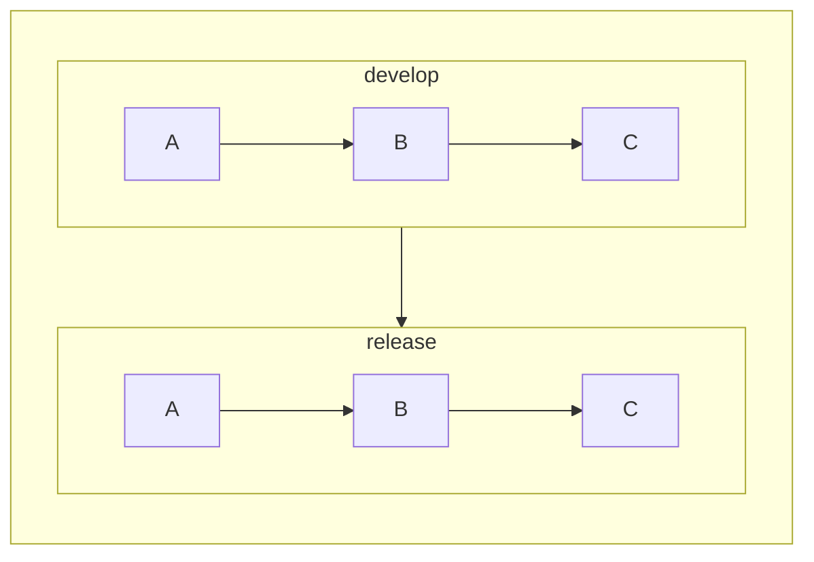

それを `master` にマージする。

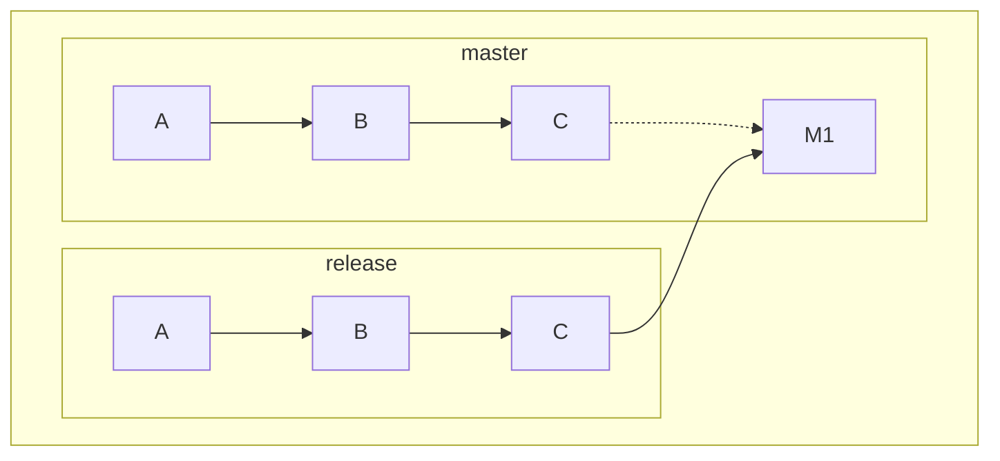

そして、`master` へのマージ後のマージコミット (M1) を `develop` に逆輸入すれば、基本的に `develop` ブランチが Fast-forward な状態となる。

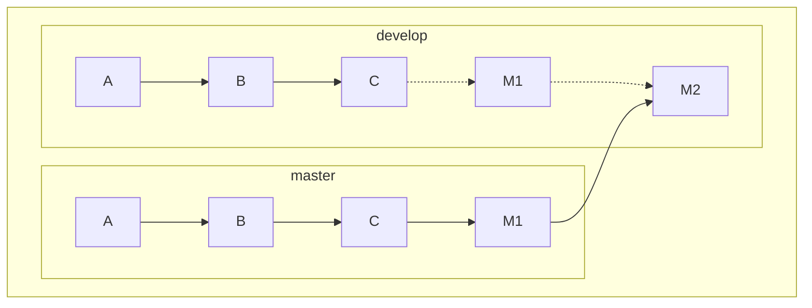

ホットフィックスの場合も同様である。

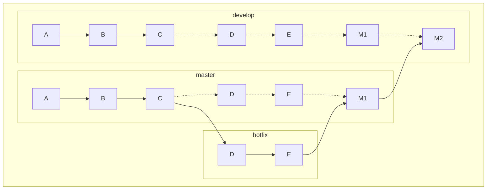

コミットの取りこぼしなど起きるわけがないし、リリース作業自体もやることが明確でわかりやすい。

## Cherry-pick Flow とは何か
では Cherry-pick Flow だとどうなるか。

本番リリースする際に **`master` ブランチからリリースブランチを切る**。 `develop` からではない。

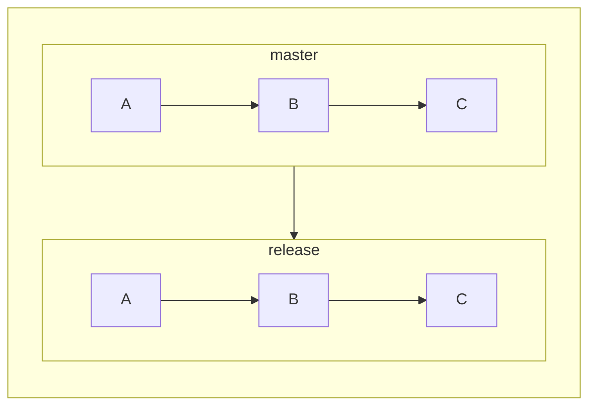

そして `develop` ブランチの中から、**今回リリースしたいコミットだけを cherry-pick してリリースブランチに取り込む**。

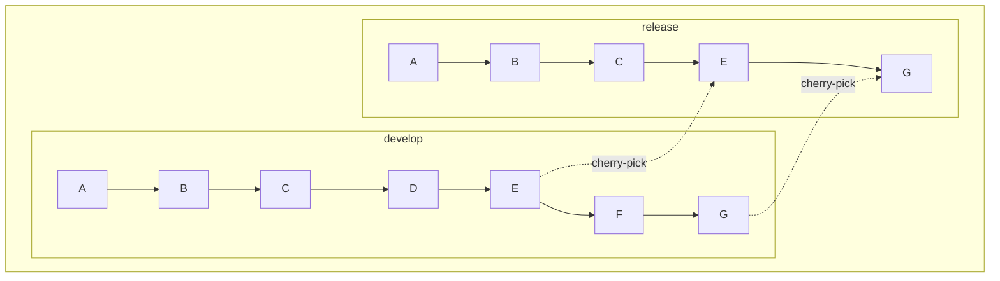

上図の例では、コミット `E` とコミット `G` のみをリリースしたいため、それらを cherry-pick している。コミット `D` やコミット `F` はリリースされない。

それを `master` にマージする。

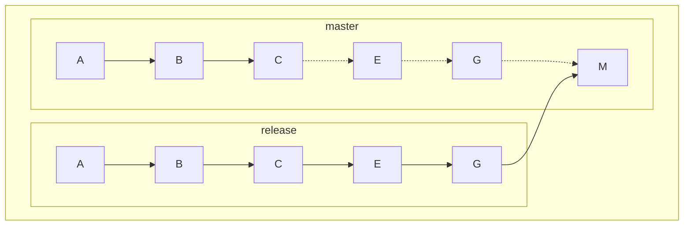

最終的に以下のようになる。

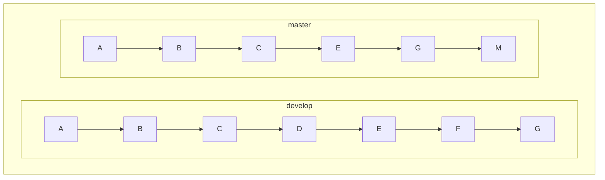

`master` には `D` と `F` がないし、`develop` にも `M` がない。

`M` はマージコミットなので、これだけならまだ `master` に取り込まれていない機能がある、だけで済む。

しかし、実際にはこうなっている。

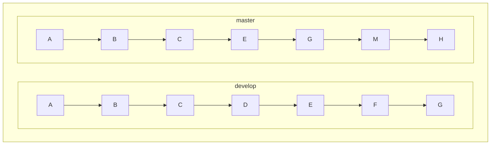

`H` が `master` にのみ存在する。これは本番環境でのみ反映させたい内容である。本来なら環境変数などで処理を分けるべきところを、ブランチでコードを分けている。本当に地獄である……。

これに関しては「[本番環境と異なるコードを追うのが非常に困難になる](#本番環境と異なるコードを追うのが非常に困難になる)」の項目で詳しく解説する。

## なぜこのようなフローになったか
筆者もプロジェクトの最初からいたわけではない上に、初期メンバーも今は一人もいないので詳細はわからないが、`develop` ブランチを、いわゆる `feature` ブランチのように使ってしまったことが発端らしい。

Git Flow なら、`develop` ブランチにあるものは、次のリリース時にすべて本番、つまり `master` ブランチに取り込まれる。だから、**`develop` に取り込まれたものは、いつでも本番リリースしても良いような状態になっている必要がある**。

しかしこのプロジェクトではもともと Git Flow などは採用されておらず、とりあえず PR を `develop` にマージするようにしていたようだ。そのせいで、今すぐには本番リリースしたくないような内容も `develop` に取り込まれてしまうことになる。いわゆる中途半端な状態というわけだ。

_「本番リリース時に中途半端な変更は取り込みたくない。今回リリースしたいのはこの変更分だけ」_ ――― これを実現するために cherry-pick で必要なコミットだけを取り込む運用が始まり、**地獄のような負債を生むことになる**。


## 金で解決できない地獄もある
地獄地獄というが、具体的にどのような地獄なのか、また、どれくらい地獄なのかについて、まだピンときていない人もいるかもしれない。

そこで、具体的に Cherry-pick Flow がどのような弊害を生むのかについて見ていこう。


### リリース時のコンフリクト地獄

2022 年の 2 月にそこそこ大きめの機能をリリースすることになったのだが、そのときに `develop` からリリースブランチに cherry-pick したときのコマンドが以下である。

```shell
git cherry-pick d772162217a0f673de7553967fa430af1a52bbe8 d86cd3d8bae8897d391a0decb1aadb05724717d0 3dda8f526aed188449336fcecfe051c554142c90 10d30e9cdc235ba09509c9bb8c9da9625989d804 3dc695dca4820a402ec38276fb4da86689483de1 664a42f11df76b41cc9e26415319b6b37207509c 4d0cd58736d76e1a78a912f740d11009e1c1179e 6aeb1bc48430e65e5d3361ec46ea17a2656e317b c153a805803826dc79dbb9e2c75f3e480bbeee73 8187a88d2f1cd647d7c2bba210a4e25935b90b06 d422b9aaa1e077f3f33b60356529bb4e22933cb4 f873949a7a4961251476ea661d263cb4da45c1dc 498ab8e007961e5cfbf922c82e7159e3640e42e1 0517db912141da8d9a5f9ab1ea671a764f672949 4cb5caa00f64f0a13799d2a402eb4b3c621de8bb d1c5a091e649930182fcc0e362a6446d7aed671e 0f84a93200addf4cabf58d7fd64e5a3df81b716a 046e4caaeb1f4f7d563f4457f865e1c0cc773d67 b519293ae7b985aaef0f3c127dfa623818908cf1 ebb567fb93ccbcb777e0fb5f92aa4984e0552a39 bbfd06b7bc7f8fcc6a90a54bb915112c4ce80fb4 8d60417a10fd073b0ca6b547295edb4e9ddb0c1e b03a6ffae1a3f47c73c8150fd38ce9d6ec2a1a83 1d77c94e21a4243397e45ffb33c9f5861e9a90d7 25811d93fbe093e890706024d314a6c5af911007 b64e3bb987773f9ad8fe09477096545197125f30 6ab894d8445425213ae8ff344bb03ac375c560ec af993851b2c13d828b629e376c5af87d3286c017 b85a1d108dd372f97a9c130531d7094cd92ec527 146d3d5248deb11dfb8f9f3e9ecf24e40ee84250 54f0cad4a35e6ef3f3a72ec493e910239f2dd6d5 984f02811f9ee0d399222f784eb02f78ec5edf3c a7acac6ab4c4b9c29a8039c34dec510bcddbb7f2 4bf689793a3a5082d7a26e7a6e5d084110dbc11c d4ab9de0646d51ba040caf0f221bacdafbc66a8d 5ea65a2eb4e5da2b5e9b9b36fb1e30f4434d33eb bd10bce84f033b56cce1b269251216255ee53bbc a2d6c3b72db99388a58968ef7eb2e7b6ecb91154 dcac8123f0b8063f53ac46e7897e8bef26d2d112 19ed1e4e56f205c959ca3b741d749e0027cf134a e069054c99ed324c0fe2b12f051922126be8c75e b70b94056b0f97dbbcd1518eabb6e649646f7c06 6bd9c55a0973af07b86bc40345bdfef8b40e4b4c e545b7de70c601d47c02414998a0bd0f10e11c40 b533cf9ae40d3d17d146a4eafe8b64ea9d931095 2d99db898e2b8233b50469c1b8ea3f5f1b316ab5 8a81c74a11fdab08128b5fd06b100633027a00cb 2884ebf2d6d8c8fce2bf0bdb4fa1eced30856569 fd094e54ddb5013abc5f43bb7e93f27c67e550e6 dac9efdec633bda2c1de5fce98d2fc722867fd66 fe1316117fde7d8eb5eee306dadf88e06956c9c6 f507a844a2c185ed38ddf3e0e82893c09c03c3e5 ae1149b729e0623b2d4f750803033753c2ec2b7a 015fcd9816c8105d0b0528af35512d016fd9dc7c 43b9f930d27bb5f994191be45eb7006d431e79e9 18bfd3cb9e7642042aa6d03e50153293cf5a249b 64cf903df48e5ca3cb2a1fee934274659b1e5efe 904dd995284e2dd6a06d387a0e24103eb7de6a2c 2f59447766ce448f463ca3f8890a16200a40228a af50a2cd548ff3565e47b44b0c4ca04469642583 4f37127dd327bc9528ede513e678dee835685071 b5c0264cf34f57232b65a03287fe842257e5aca4 dcd58a55ad67b5504e30a43d2c71f3a25afc8f87 4c79b31fe97b48c7f08e727dfe039ba7ad67fede 9301a7d10b9dc0bac671b5fcf0243855209f5a21 250ba2b994452bb80eee64e7075242a5863d1b8b 7f103d6d6911660b751777c0675da7a2e83a1862 794931d48b546958a27b65bf2e47202b2f85f20f b3b8526d05ab291ae769b3f1cb6374e0d703d8ec ff735ec5905a1bfa7c134e0a9234c37c182c2a18 b15b9b6738678bef20ad3ddd0af63ebd17b04f6d da8fc418a32d43f646764d75f4b2a6dd285f6cc8 0e6a948e107dd45dbb76f3caa83da419b45c5d7f e295063cf2d53ba7cd8d93b35256c51f11a81190 ed5173fd6df3fd74e8b2d49d096e2f0f056a7d9a 6d61e087a47b47e80c8fcd4fcc5e25ecb1916bd2 39e49992044ec5d000fcdc6b97c839e0c5950db7 39a48e6bc9b5cb9919856d187902447cd18dd821 4fa881a80e15434503dc6b280ca817825c0e8066 1bf9858457311c7e9f82bcaf08d2f3a7526589f0 911a5329df20f80e22ca9364f12228543a27607b 1d38a9e821d0cb5c064c3e6d1c310a64b6451321 c1b8b2fc5cba117d3c3ba336a8aa4c4da375fd8c b9fa01992a3526d8318a6d7285e72987464d8674 d53af25f0cc7e5b1bfa9a3a61bf787259a7d415e fa9fd5d38b76a8e446a839d07687b5a6f32b51af ebb65998cfb178a6a846fb6350385a0cac057fe6 67afef591ea7758a82a26d27412037e20fe71049 92248949db556c24f855b77dbf717543ee52d736 6ccdf332690ef1e1df0d15774369b29b05e8d162 0623037663c858674ab450d9a495c72e784d7e7b c4c2e453cb0bbb1983d3340818a4194b58e49a10 d39dfb49e79c1792dfb54e89a0bad6f8607a2ff2 393d29ec5820e8cf3a3117b6150862dd815c61f0 e5c46ef1735483a8638f0510c8cbdf2f8b79a1dc e6fa597c0db5bc6f5c3f66d9286d1073af3fb8f7 19eff1dcb31c7b3aacb74522dce92567257477bb 9efc50cc9278cdf5422d3fd514475d1080deedda ade1498639582ff96344628bc051d67c770b3a8e 7ec1729f76115840fb8c809d8235dccab837e359 5434226a4abd7ad71f912daf185340d1cc0dc3a7 3966e413664662ba23ba93fa48fb53a19419a361 2b7d95e09191888a74a9bbee37fb3d4d9ad81036 27a6c55dd65d6588c1f26317236a981308a0fc11 0e6a2708569e81fe0466b1c40a4f75308d0f0947 3d06111d4ff6b4771dc075efea7302157cf8b6f8 d147c91e50ba8caf58cce199401fe732ed359a75 59865eb6205c2f2e286dddc258ce784ec22994ee fa4c9cf93828c902509acf354f5e894a0e5c2793 fd1e7971e6a82ef2a45d4645b49e454efab68fcb 63adfd27cfb0b865f0deb6548fbdbb2d0c9c7d6f 4ba13aacb853f2a9c0160c17eb37ef04b832103f ce5470e183d3fc2115da464d2df92667974b5039 96f48424896c7e669b1f160cbda56a48fa7971a7 e2672ef08f9146ac5a9bf23afd39b8d9a54b6ed3 ee884c3cd6fbfb0e7b517d7d34d4f83159e7a17b d27c6390cc3e32118e4c9bc5b609154ac1121552 019a1c0381e5e1a198464667e0d92fa7472858ef 012262d16aa08c53ae77f256565705fb0e7df169 06e7daf0489b818ea5ec5f9b72ee5bdd2ffb6884 e29f2dfcc591dfcf41917ca6cb8ae764d25ede50 a91e8858773f49f28d8a6b46851f382ca2e1690a 46749d8753d5bab52533adf850bf5dcf78bdf0bb f9edbd4038573f6287d60e9cdb1722e6a491e9a8 d6865d0b0c4df8f848796db9be7f03815ae53067 bec3774532864c16f1130639b4a4f418adc9f7e5 0d74baaf394976e2fcac4a568f9acd9cb6434388 3f9381bde00360322d0fc0aa25d0c21c5ab95faa 5a47d9033e1a587bd1f00b0beee35988347f765e 1d865cea84d97575975440669b77149fb6fd2af9 72dc282888e4ba72692d3d505baf7133218084b3 5ab7f3d18002cea86d3b944f19a37b67f65b51ad 03a9cef6cffdf048de40e308754a04774c05a8f5 d2587133a0d505dbd87304af8515c7f39bb80365 1216f213cf7f44e3d725541e8ef76fcaa4e04af2 d119ca14b9d96f11f43d4500e4411fde5e9f36e6 eded1b12933d6b3174f66cf07bf5d48918168d41 96358378cccb2e39d5fb88bbc6441a8286536e42 45d555b31edd89df783f57d2d5c6c594f575e470 9dc7b0c26abed9d41f0b010494ba42bed0e9f784 719cc339f25c25a7100f875aef01e458fb2a652d b0dc4a7bb966a8143e738272f387763b09504437 baa17eae5be42692cac2f9f31b8068d85c3466d0 a9880b7a1084d8a5c835f10c0886b62440a1f982 e789a4dd3fe90c2f36502c01e07769feff1f1d1a 09ee5135f49e087655385b74472e0b1abb6bfd3c 2df37dc26525503237e053588d53d28a18b9b695 352ea30a52d81f050b06f4bce2b47f90926cc98c 055263c6ecc88242ee59336ef4adecf2aec3d5d6 9c8842f4361b28efff93fead0643b1ab2a918330 bf4bfcf539dda294e0c63c90aa11366a84297a21 fca6d4cebac14e987e8fa66a84c7fddc0d820198 2e1bfcc7a6cd516ec5a09b412107b41f1b1fdd67 fe3b24de23426b8cc559590aa28f2d644fa936a2 49297aa9096d4512c0ac9f545c8ec129a757761e b9196699871b8203413e282c4d99dc1509e5b33a 1e229a43500cb62d51471f08f959a53bc9aaabac 6a1409d2cb0058f3542af6e820ae250b683f7cd3 c39ea0a701ea779c5cb64f339b90d9db12a25cfb 2b850e4a9e2c322ea7edf1957a2f88635da3aed3 717418bdbf8967cbd325ce05626785ceb5d8141a cd99cdf0f8b094d46d47e9dc16cc6d9c2bf6026e 8675e8bd481b86bd0622ebb3938fa8f2c47f09b3 91f3019730ff2dcd0e505472b11b39a2acd3aaf2 c52f51618c5bcbae95f8b8c09b8b5eb0946be99b e7d07e4e6529183d322d3284bc0efda5666165ec 7d9d02922ffcc810a31d56ffec3d106f19bfac1b c75b16d7b0dfa873e2c59a6514a7fcd674bcf889 642d1cc580bf5c4b4e8cf9c9304dec87f42156a7 091644eb16494a08fca3a45cbfc08c856afa0c2f 1ff391eae8ef5b529f38620fc2f480d1894ea965 d01925c65ecfc14ddf6aa64b7680c40da3d945b4 95e7ef5fd29a1c9d56d861f0e9ab2a7cd6ae4cb8 14632f972a0f50bd358a67653643339721b88e6e 419ae71c5daadbf991556a9cc394317704971e4f 32d56280d5515afa34863491e9aafd762e48cbfc 913f0b118a390cdb02aeb140dc55e603d37adba0 5ca097ea2fefeaff82cf49635ae5557a7683bc73 38d3634a2f97632ec4e71cc3462539914df2d214 a61f27ee1687efa885cfee05c7e9fc100dc460ad 532896b9ad4d20c25a5df5d5067cd70181bed334 beb9816f16e41745318fe6637f6d94216ab25add a770ce428d580ea8981fc37ba49a43d7ce18f784 18fa99048b9bd52df18c783c6818ad37cdb2c6a7 3baa21439062ac5aba8ea4d92ab9ed4c40945c9e d0d0b41ca3cc14887cb65c23ab3afcd598df5ff4 b3ea1d0de7a44b964765218e1032fa95c0f64e4c 57e358b5567a845953d51cd7e600559f179f5087 f97b4883dc857a73ec5ee4249c92948529a7da5e 928915b62c8f5113e05efa54bba077bb97cdfc45 909a293868ccb000d94371eb6e218dcccd0dd0d8 d0ce84099b325f132381299e61bf5177544cc538 8ecaf13872cbcb8d788820aa9034c864d42cb124 7b246caf70d05476b5cfc273bbd836e5aaac175e ab1bce72e38654191c57dd99495ffe85e7d2f47a 6ba15439cad8528390cd03906fbbe813e4f1ffc8 b859e8d710890b28ea34c7f360c46fd70b557036 3789526a68b75e20aaabc2d6018c710edc613bc0 bf063e762910863c84b2de61db15d54fb275f34d 40ab281a0d04d947746d7d143d3a0077c298560b 40a9f9708c72640b34440c88e1d480cac7a86710 3993949da8f99afc51dfc15772b7827ebabe1ac9 fcd0e47770f982ff430cb8c2c3e90f92b4810daa 26348e0bbb00b2dd5759b19cbbf0ffd6d57a5f87 4aa134a0e0ca65e94b1a2405ee74e8461d26c224 9be254b9590ecf11dad8d4e5438e1e7910c12fc2 f888b98fcf888315fd54bcc82ee53179c807c76e 7d745ded6c56a0eb912713c0f641f625a8d51524 4dbc600c3992e660ab10e26dcf1b929727ab13a5 fbc37f3b6b72c825a51381480c63f1e2bed47e53 0ce710dac43e96cb70b6943c84077c7f15618de1 9367ffeb4c0216502f3aacfd95e525a554795c38 1aeed8393b785d35a7bd2b540b9fb5086cd746f4 100a36906095499918e86a78fcea0199e882141b cc914c4070ecd251860362f2a9da8cb61e188082 023481ead2b7521b616cfd76e6d2ad152d026665 751967aba80c062ed039fc5e6048c1c923387c06 24624fd050422fbc740e9bf6af6d0e0dff961ae8 c4083b096addd52ffc8e3642d57cca4f5925af44 230ae52fd2b15b1c1d46b0f58559d0aca123dbf5 195d5aeccb189e2c574f50fa954048d2da4118f0 30a23f010a422c3b6cc9ed99231a177cc8cea168 c542765666bffc9d09944695236803a6949e7d93 ea315dd1aced4512d29c75f7900e6be46b42412c 91364dc9463850233c9ea06b66b34c51f535b624 4483ea3a358f599558e1cdd215fe90798bcf952b 8f66276ab7e27225ddb4c1ca0b6169d2fc027cd1 b5fae781dcaa435deb92f336090957164fd47028 3b9c918a4eb2ead8a8140f2b3fabee7be6b62927 7ea1fc3df0e39f62731b7a6fad2e05bc08a4ed25 a7c7c3c7eb94758d96250d19688b32ff590258ab 5b38c3151e7b9f73adde06847d824ad417bec62d a46d0558852b753d71712bc3c16f3db8b9502eb8 a3899d287b5f44b10fd5c0d686dce5ddd938439c 466efb194fbcbf5758a0a8b663c57ac4980a6eb2 dc0229c2398a0f36bb87519a7d6b4c9ce354aabd 52d868e183e202594193185761cc3a8671916c47 add3ba1e3ae624ddbec601c9275bf7946dbae5a7 7fa7a38905a87d011c09ade36a9cf7ff11376608 850456769207b14c93a8baecdd92984398bc4df0 d11371921897f39e4616c4bb1ab7a0fbda39cba3 32fb587afccb4ef870136569d562b95d9ce3a3d5 0c46c630e5cc824424b33411bca5f9fdd4f45acd d2a1f4fce8c3d99a0dba827084535adb966ce34f efa420644cf38e29f8c11af9ffe7057201d08882 3bce7f8770bcedbd214e81a03e5f5d3d28dfc0a9 a33baf24e41170a950cba11deb33bf7d779d49c1 66f4bd68beeeaf329d52c206fb871269d3403501 fec077fbd2cdea54f6ddfc23fcfa32df0055cee5 a1f56c6bdda8b2523613fc19641b15cfbc458983 5c0ae01bc8fe8b028a0d98a2148896adda662b88 eece5baed89489c98a290f903560e8ab6382d984 3abe7f656daf2d13b705fbf08381ebd409f101f8 8b4f80a588aff2984f2b2598d49cabfe5289448b 9c4a140f24988c2e094646c4940ae3282fbff8e2
```

ちなみに、摘み取ったコミットの数は 255 個[^1]ある。

[^1]: 偶然にも `2^8 - 1` だった。

[これらのコミットハッシュを拾い上げること自体はスクリプトで簡略化できる](https://github.com/noraworld/dotfiles/blob/c5cc28a75881e3d4ea3a375df3f6d63568ef496f/bin/src/git_subcommand/git-release-pick) のでさほど難しくはない。問題はそのあとだ。

特定のコミットだけを拾い上げているため、**地獄のようなコンフリクト連鎖が発生する**。

`develop` が Fast-forward な状態だったらまだマシだったかもしれないが、`master` にしかないコミットや `develop` にしかないコミットが入り乱れているせいで、コンフリクトがありえないくらい発生する。

この 255 コミット分の cherry-pick の間に何回コンフリクトしたか正確にはおぼえていない[^2]が、ゆうに 50 回は越えていたと思う。

[^2]: おまえは今までに解消したコンフリクトの数をおぼえているのか？

コンフリクトはいっぺんにまとめて起こるわけではなく、一つずつ解消していかなければならないのもまた地獄である。

さらに、コンフリクトではないが、マージコミットにぶち当たるたびに cherry-pick が中断され、操作を選択しなければいけないのもつらい。PR をマージするまでの間に `develop` が別のチームメンバーによって更新されるとコンフリクトが発生することがあるが、そのコンフリクト解消のためのコミットはマージコミット扱いになるので、上記の 255 個のコミットの中にはいくつかマージコミットが含まれているのだ。マージコミットは、本来は `-m` オプションなどを付与しないといけないが、これだけ多いと個別で `-m` をつけるのも大変なので、逐一 cherry-pick が中断されたタイミングで `git cherry-pick --continue` または `git cherry-pick --skip` をする必要が出てくる。

やっとの思いで全部のコンフリクトを解消しても、コンフリクト時に採用するコードを途中で間違えていてうまく動かなかったりテストが落ちたりする。コンフリクト解消は手作業なのでオペレーションを間違えることもあるし、他の人と共同で編集した際のコンフリクトだと、どちらを採用すれば良いのか毎回悩む羽目になる。


### シンプルに摘み取りそこねる
これは容易に想像できると思うが、リリースする機能を含むコミットを cherry-pick で一つずつ摘み取っていくので、オペレーションミスで一部を摘み取り忘れることがある。

実際、リリース時に一部のコミットを摘み取りそこねてリリースしてしまい、その摘み取りそこねた部分を本番に反映させるためのリリースをまた行う、ということが発生したこともあった。

問題が起きなかっただけまだ良かったが、摘み取りそこねるコミットの内容によっては不整合が生じてアプリケーションエラーで障害になる可能性もありうる。単純に二度手間になるだけでなくリスクすら孕んでいるのだ。


### 思わぬ落とし穴にハマる
これは 2022 年 2 月 15 日のこと。先述したリリース対応の際に、リリースブランチのコードをローカルで動作確認しようとしたら、Docker 上の MySQL が立ち上がらなくなった。

原因をチームメンバーにも調査してもらったところ、MySQL のバージョンを上げたことによりこの問題が発生していたようだ。

筆者も詳しいことはわかっていないが、Docker 上で MySQL のバージョンを上げたあとに、上げる前のバージョンで起動しようとすると問題が発生するとのこと。

[【連載】世界一わかりみが深いコンテナ & Docker入門 〜 その6:Dockerのファイルシステムってどうなってるの？ 〜](https://tech-lab.sios.jp/archives/21103)

なぜこのような問題が発生したかというと、`develop` とリリースブランチで異なるバージョンが指定されていたからだ。

MySQL のバージョンを 5.6 → 5.7 に上げる対応をチームメンバーがしてくれて、それが `develop` ブランチに取り込まれた。

しかし、リリースブランチは 5.6 のままだ。なぜなら、**cherry-pick をした中に MySQL のバージョンを 5.6 → 5.7 に上げるコミットが含まれていないから** だ。

Git Flow では `develop` からリリースブランチを切り、そのまま `master` にマージするので、`develop` で追加された変更はすべて `master` に取り込まれる。しかし、Cherry-pick Flow だと、自分が担当した機能の部分のみをマージするため、他の人が対応した変更がその時点ではまだ取り込まれていない。

したがって、ブランチを切り替えた際に環境に差異が生じ、このような問題が起こってしまうのだ。

これは実際に体験した問題の一部であり、これに限らないと思う。たとえばアプリケーションの設定ファイルを書き換えるような変更を他の人が対応して `develop` に取り込んだが、自分のリリース対応ではその変更を取り込まなかったためにアプリケーションの設定に齟齬が生じてうまく起動できない、なんて問題が発生する可能性もある。

それらの問題にぶち当たったとき、何が原因なのかを特定するのも難しいし、そこに時間を割かれるのが本当に不毛だなと感じる。Cherry-pick Flow じゃなければこのような問題も起こらなかったはずである。


### 永遠に `master` に取り込まれない変更が出る
本番リリースをする際は、本番に影響のある変更、つまりアプリケーションの変更やデータベースの変更など、本質的なもののみが `master` に取り込まれる。

これが意味するのは何か。**アプリケーションやデータベースなどの動作に影響を及ぼさない変更はいつまで経っても `master` に取り込まれない** のだ。

たとえば筆者がこのプロジェクトにジョインしてから、Codecov や Code Climate の導入、便利スクリプトなど、DX を改善する変更をいくつか行った。

しかし、それらの変更は `master` には取り込まれることがないため、リリース PR にはいつまで経っても Codecov や Code Climate のステータスチェックは入らないし、リリースブランチで動作確認を行う際にも便利スクリプトが使えないのでやりづらかったりする。

もちろんどこかのリリースのタイミングでこれらの変更を入れてしまうこともできるが、残念ながらそのような運用もされていなかったので、永遠に `master` に取り込まれることのないコミットが生まれてしまう。


### 本番環境と異なるコードを追うのが非常に困難になる
_本番環境には Google Tag Manager のスクリプトが埋め込まれているが、ステージング環境やローカル開発環境には埋め込まれていない_。

この違いを生み出す実装として、真っ先に思い浮かぶのは環境変数での条件分岐だろう。

たとえば `GOOGLE_TAG_MANAGER` という環境変数が本番環境でだけ用意されていて、Google Tag Manager のスクリプトを埋め込むかどうかの条件分岐がコード内でされていることを想像する。

```ruby
if ENV['GOOGLE_TAG_MANAGER']
  # Google Tag Manager のスクリプト
end
```

2022 年 2 月、ここらへんのコードをいじる機会があったのだが、いくらコードを見ても本番環境でだけ反映されるようなコードが見つからなかった。

本番環境で設定されている環境変数を見たりもしたが、それらしい環境変数が本番環境でだけ用意されていることもなかった。

完全に煮詰まってしまったのでチームメンバーに質問したところ、なんと **`master` ブランチにのみ Google Tag Manager のスクリプトが埋め込まれていたのだ**。

つまり、コード内で条件分岐するのではなく、ブランチで出し分けていたというわけだ。しかもスクリプト内のトラッキング ID もハードコードされていたため、本番環境でのみ存在する環境変数というものもなく、これに気がつけなければ謎のままだった。

本番環境と動作が異なる部分の原因を追うのが難しくなるというだけではなく、該当するコードを変更してリリースする際に、もれなくコンフリクトがついてまわる。

どこに潜んでいるのかもわからない `master` と `develop` 間の差分によるコンフリクトに当たる様子は、まるで地雷を踏まないように気をつけながら外を歩くかのような恐怖がある。


# TBD
では、この運用を廃止するために行った作業を具体的に紹介する。

## 用語解説
### `origin`
今まで開発を進めていた、もともとあるリモートリポジトリを指す。本家のリポジトリ。

### `tmp`
今回の cherry-pick 廃止作業用の一時的なリモートリポジトリを指す。作業開始前は 0 コミットの産まれたてほやほやのリポジトリ。

## 登場するオブジェクト
登場するオブジェクトは以下の 4 つ。

* `origin` の `master`
* `origin` の `develop`
* `tmp` の `master`
* `tmp` の `develop`

## 作業フロー
一連の流れは以下の通り[^3]。

[^3]: なお、ここで解説する一連の流れは、後に登場する図中の作業番号と合わせるために一部の作業が省略されている。省略されている部分に関しては、さらに後で詳しく説明する。

1. `tmp` を新しく作成する
2. `origin` の `master` を **コミット履歴を保持せずに** `tmp` の `master` にコピーする
3. `origin` の `develop` を **コミット履歴を保持せずに** `tmp` の `develop` にコピーする
4. `tmp` の `develop` と `tmp` の `master` 間の差分を埋めて `tmp` の `master` に上書きする
5. `tmp` の `master` の内容を `origin` の `master` にコピーする
6. `tmp` の `master` の内容を `origin` の `develop` にコピーする
7. `origin` の `develop` を `origin` の `master` にマージする
8. `origin` の `master` を `origin` の `develop` にマージバックする

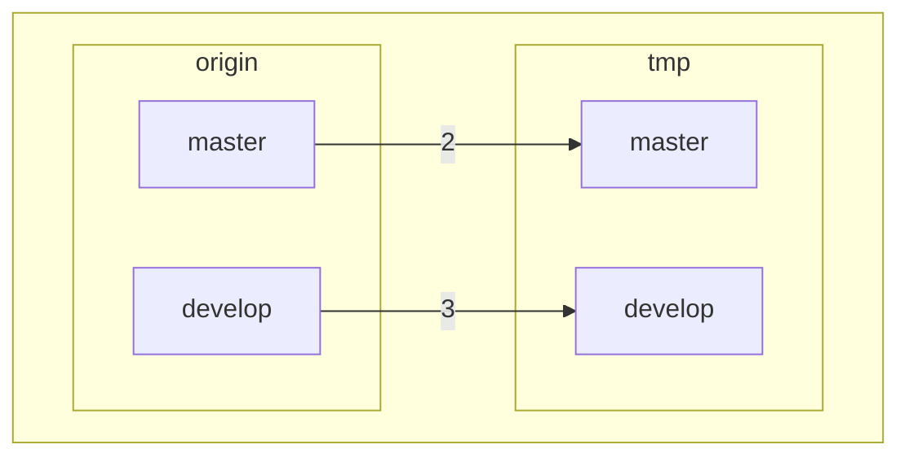

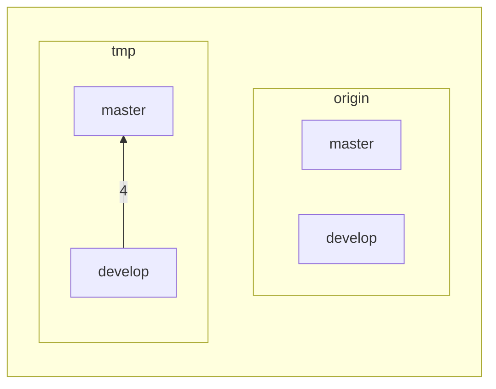

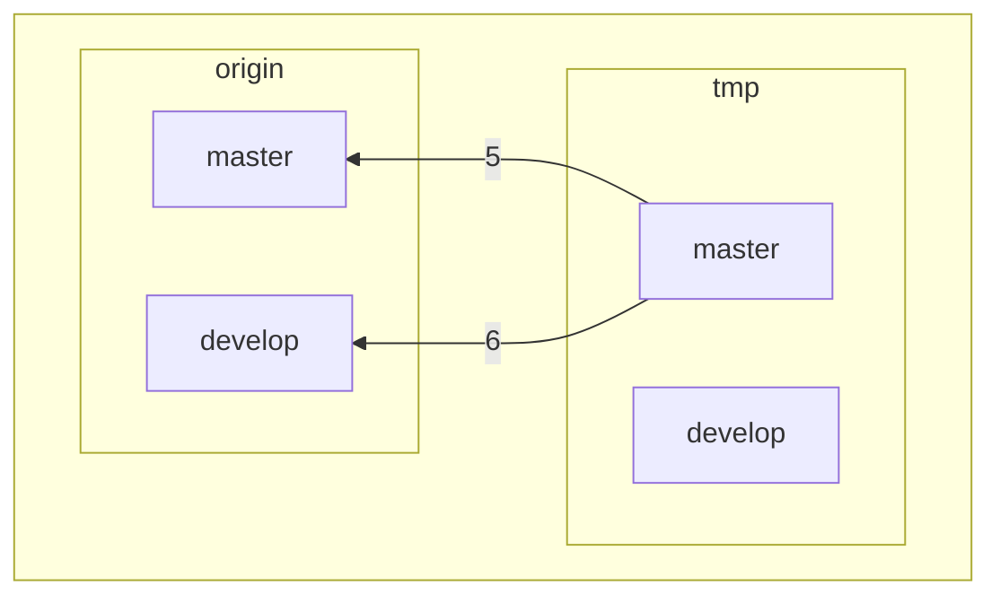

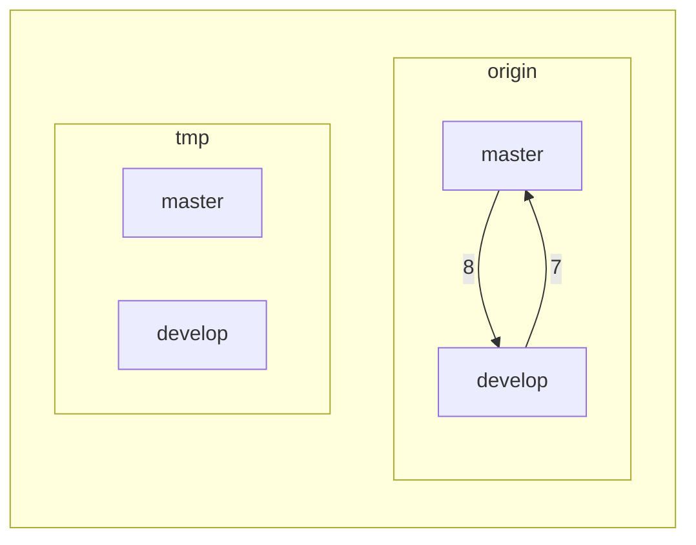
