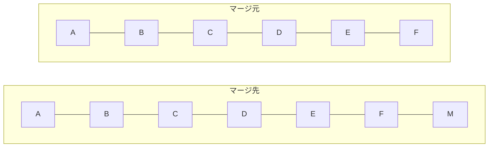
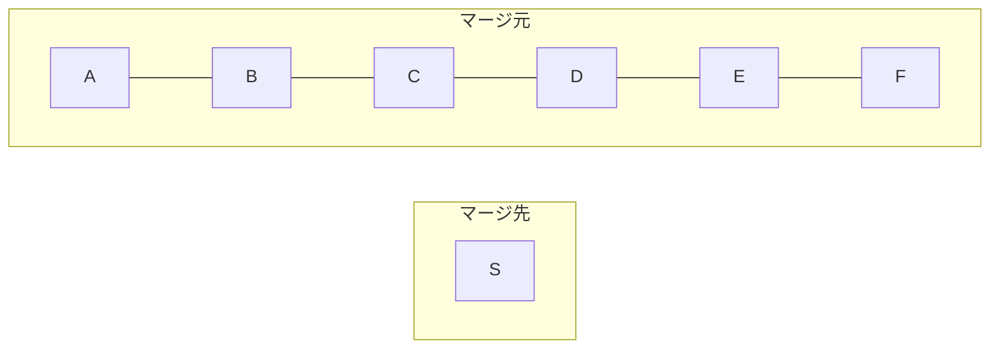
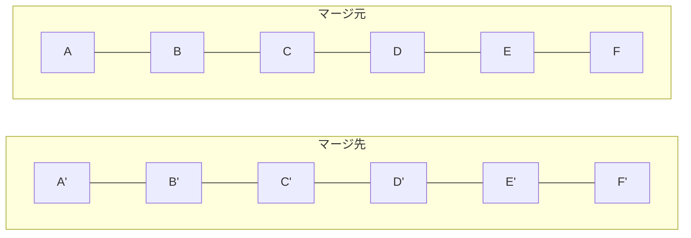

# はじめに
GitHub で PR をマージするとき、以下の 3 種類のオプションがある。

* Create a merge commit
* Squash and merge
* Rebase and merge

この 3 種類のオプションの違いについて解説する。

# Create a merge commit
* PR にあるコミットと全く同じコミットハッシュのコミットがそのままマージ先ブランチに追加される
* それに加えてすべてのコミットの差分をまとめたマージコミットが新しく追加される

## イメージ

`A` 〜 `F` は、両者のブランチともにコミットハッシュ含め全く同じコミットである。

`M` はマージコミットで、`A` 〜 `F` までの差分がすべて含まれている。

## 詳細
以下のスクリーンショットは PR のコミット一覧のページである。コミットハッシュの部分を赤枠で囲んでいる。

そして上記 PR をマージしたあとのマージ先ブランチのコミット一覧のページが以下のスクリーンショットである。

表示順序が逆になっているが、コミットハッシュがマージ元のブランチ (PR) のコミットのものと全く同じであることがわかる。

それに加えてコミットメッセージが `Merge pull request` から始まるコミットが新しく追加されている。このコミットは PR のすべての差分が含まれている。

本質的なコミットとは別にマージコミットが増えてしまうので、コミット履歴は汚くなる。

その代わり、PR のコミットと全く同じコミットが取り込まれるのでややこしいことが起こりづらい。

Git フローで開発していて、リリース時に `develop` ブランチから `main` ブランチにマージするとき、このオプションを使うと、マージコミットを除けば両者のブランチのコミットを同じに保つことができるので比較しやすくなるというメリットがある。

# Squash and merge
* PR にあるすべてのコミットを 1 つにまとめたコミットがマージ先ブランチに追加される

## イメージ

`S` はスカッシュしたコミット (1 つにまとめたコミット) で、`A` 〜 `F` までの差分がすべて含まれている。

## 詳細
以下のスクリーンショットは PR のコミット一覧のページである。

そして上記 PR をマージしたあとのマージ先ブランチのコミット一覧のページが以下のスクリーンショットである。

コミットが 1 つにまとまっている。コミットハッシュはもちろん新しく生成される。

デフォルトだと、すべての PR のコミットメッセージが詳細部分に含まれる。

コミットがまとめられるので見た目がスッキリする。コミット履歴をきれいに保ちたい人には重宝するだろう。

ただし、Git フローで開発していて、リリース時に `develop` ブランチから `main` ブランチにマージするとき、このオプションを使うと `develop` ↔ `main` 間のコミットがバラバラになって比較が難しくなるのでおすすめしない。

# Rebase and merge
* PR にあるコミットのクローンコミットがマージ先ブランチに追加される
    * **コミットハッシュがすべて変わる**

## イメージ

`A` 〜 `F` は、コミットメッセージや差分に関しては、それぞれ `A'` 〜 `F'` と同じではあるが、コミットハッシュが異なる。

そのため、Git としてはそれぞれが別のコミットという扱いになる。

## 詳細
以下のスクリーンショットは PR のコミット一覧のページである。

そして上記 PR をマージしたあとのマージ先ブランチのコミット一覧のページが以下のスクリーンショットである。

一見すると、PR のコミットがそのままマージ先ブランチに取り込まれたように見えるが、**コミットハッシュがすべて変わっている** 点に注意。

コミットメッセージやそのコミットの差分はもちろん全く同じなのだが、コミットハッシュは異なる。そのため、Git からすると別のコミット扱いになる。

差分がなくてもコミットハッシュは異なるので、コンフリクトが起きることがある。

こちらも "Squash and merge" と同じく、Git フローのリリース時にこのオプションを使うと `develop` ↔ `main` 間のコミットがバラバラになる。特別な理由がない限りは避けたほうが無難だろう。

# まとめ

| 種類 | 挙動 | メリット | デメリット |
| --- | --- | --- | --- |
| Create a merge commit | PR にあるコミットと全く同じコミット + マージコミット | ブランチ間の差分が比較しやすくなる | コミット履歴が汚くなる |
| Squash and merge | PR にあるすべてのコミットを 1 つにまとめたコミット | コミット履歴がスッキリする | ブランチ間の差分が比較しづらい |
| Rebase and merge | PR にあるコミットのクローンコミット | PR のコミット内容をそのまま反映できる | ブランチ間の差分が比較しづらい |
