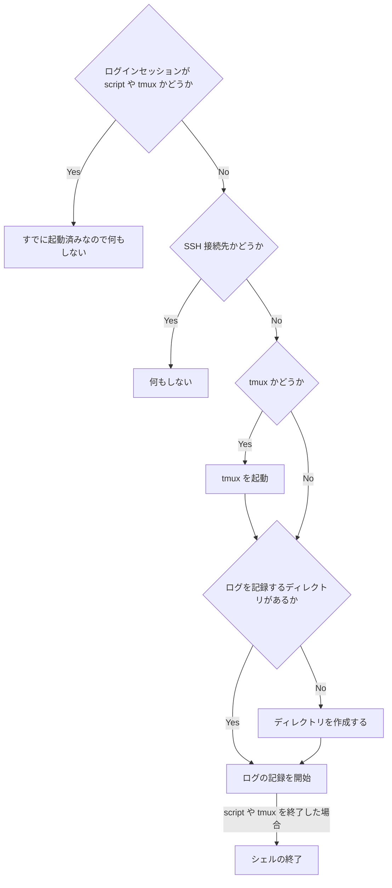

※ この記事は [Mermaid](https://mermaid-js.github.io/mermaid/#/) を使用しています。

# ターミナルの出力を自動保存するメリット
* ターミナルの最大スクロールバッファ (最大出力行数) を超えて、ターミナル上からは消えてしまった出力を見返したいとき
* ターミナルを閉じたあとに出力を見返したいとき
* 大量の出力の中に埋もれた特定の出力をテキストエディタなどで検索して探したいとき


# ツール
* [script](#script)
* [ttyrec](#ttyrec)
* [screen](#screen)
* [tmux](#tmux)
* [iTerm2](#iterm2)


# script
## 特徴
* ログを記録するメジャーなコマンド
* BSD (macOS など) や GNU/Linux (Ubuntu など) に標準でインストールされているはず

## 使い方
### GNU/Linux (Ubuntu など)

```shell:Shell
script -a -f <FILE_PATH>
```

### BSD (macOS など)

```shell:Shell
script -a -F <FILE_PATH>
```

### オプション

| オプション | つけた場合の挙動 | つけなかった場合の挙動 |
| :---: | --- | --- |
| `-a` | 既存のファイルに内容を追記する | 既存のファイルの内容を上書きする (削除する) |
| `-f`<br>`-F` | ターミナルの出力がすぐにファイルに記録される | `exit` や `Ctrl-D` で script コマンドを終了するまでは記録されない |

## デメリット
* [BSD 実装にはターミナルサイズの変更を認識しないバグがある](https://zenn.dev/noraworld/articles/script-command-bug)
* 制御文字が入って見づらい
* ググラビリティが非常に悪い


# ttyrec
## 特徴
* `ttyplay` コマンドを使ってログを再現することができる

## インストール
### Ubuntu

```shell:Shell
sudo apt -y install ttyrec
```

### macOS

```shell:Shell
brew install ttyrec
```

## 使い方

```shell:Shell
ttyrec -a <FILE_PATH>
```

### オプション

| オプション | つけた場合の挙動 | つけなかった場合の挙動 |
| :---: | --- | --- |
| `-a` | 既存のファイルに内容を追記する | 既存のファイルの内容を上書きする (削除する) |

## デメリット
* 制御文字が入って見づらい
* ttyrec を終了しないとログが記録されない


# screen
## 特徴
* ログを記録するのが本来の用途ではなく、ターミナルを便利に使える様々な機能が用意されている

## インストール
### Ubuntu
Ubuntu Server 20.04 には標準でインストールされていたが、インストールされていなかった場合は以下のコマンドを実行する。

```shell:Shell
sudo apt -y install screen
```

### macOS
筆者の環境ではすでにインストールされていたが、インストールされていなかった場合は以下のコマンドを実行する。

```shell:Shell
brew install screen
```

## 使い方
1. `$HOME/.screenrc` に `logfile "<FILE_PATH>"` と `deflog on` を記述する
2. screen コマンドを起動する

```conf:$HOME/.screenrc
logfile "<FILE_PATH>"
deflog on
```

```shell:Shell
screen
```

## デメリット
* ログの記録のためだけに使うには高機能すぎる
    * ログの記録以外の機能を使わないならデフォルトの挙動に戻すために設定のチューニングが必要
* ググラビリティが少し悪い


# tmux
## 特徴
* ログを記録するのが本来の用途ではなく、ターミナルを便利に使える様々な機能が用意されている
    * screen コマンドよりも高機能らしい

### Ubuntu
Ubuntu Server 20.04 には標準でインストールされていたが、インストールされていなかった場合は以下のコマンドを実行する。

```shell:Shell
sudo apt -y install tmux
```

### macOS

```shell:Shell
brew install tmux
```

## 使い方
1. tmux を起動する
2. pipe-pane でログの記録を開始する

```shell:Shell
tmux
```

```shell:Shell
tmux pipe-pane "cat >> <FILE_PATH>"
```

## デメリット
* ログの記録のためだけに使うには高機能すぎる
    * ログの記録以外の機能を使わないならデフォルトの挙動に戻すために設定のチューニングが必要

## 備考
### capture-pane では自動的にログを記録することはできない
`pipe-pane` とは別に `capture-pane` というものもある。

しかしこれはログを自動的に記録するものではなく、`capture-pane` を実行したときに、すでに画面に出力されているログのみをファイルに記録するというもの。

その代わり、制御文字を含めずに記録することができるので、特定のタイミングでのみ手動で記録する用途には向いているかもしれない。


# iTerm2
## 特徴
* iTerm2 に標準搭載されている機能
* iTerm2 がインストールされていれば別のツールをインストールする必要がない
* 制御文字を含めずにログを記録することができる

## 使い方
1. `Command` + `,` で Preferences を開く
2. `Profiles` -> `Session` -> `Miscellaneous` に行く
3. `Automatically log session input to files in` にチェックを入れる
4. `Change` ボタンを押し、ログを記録するディレクトリを指定する
5. (optional) 制御文字を含めたくない場合は `Log plain text` にチェックを入れる


## デメリット
* iTerm2 を使っているときでないとログが記録できない
    * ターミナルアプリに依存するので、別のターミナルアプリを使いたいときに困る


# シェル起動時に自動的にログの記録を開始する
以下のリンク先のようなシェルスクリプトを `.bashrc` や `.zshrc` などに記述すれば OK[^1]。

[^1]: リンク先のファイル名が `.bashrc` や `.zshrc` になっていない理由は、単にファイルを分けているからなので気にしなくて良い。

* [script コマンドの例](https://github.com/noraworld/dotfiles/blob/b3c67b5d4497cb2c68177be2f99132348be95677/zsh/record.zsh)
* [tmux の例](https://github.com/noraworld/dotfiles/blob/5b5bfca19c84360f04162d986f62c3a5e49cd79c/zsh/tmux.zsh)

## ロジック
大まかなロジックは以下のとおり。

1. ログを記録するディレクトリが作成されていなければ作成する
2. シェル起動時、ログインセッションが script コマンドや tmux じゃなかったらそれらを起動する
3. script コマンドや tmux を終了したあとは (`exit` したあとは) すぐさまシェルを終了する



## 備考
* `SESSION_LOG_PATH` には、ログを記録するパスからファイル名を除いたものを格納しておく
    * 例: `$HOME/.log/tmux`
* SSH 経由だった場合は無視する
    * 接続元のコンピュータでログは記録される (接続先ではログの記録は不要な) ので
* tmux の例では、tmux を起動したあとに `pipe-pane` を実行しないといけないので script コマンドとは少し処理が異なるが、ベースは同じ
* script コマンドの例のほうはちょっと古いので tmux の例のような書き方にする必要がある部分もあることに注意


# さいごに
という感じで、どれも一長一短という感じ。

BSD 実装 (macOS) の script コマンドにバグがなければこれが一番シンプルかつ汎用的だなと思ったのだが……[^2]。Mac を使わない人 (Ubuntu や WSL2 などを使う人) なら関係ないから良いのかも。でも制御文字を含めずにログを記録したいなら一工夫必要かも。

[^2]: 最新版の script コマンドはこのバグが改善されているのかもしれないが、macOS Monterey にアップグレードしても未だに 2013 年の実装のもの (バグあり) が使われている。
