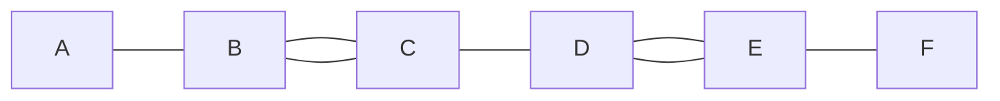
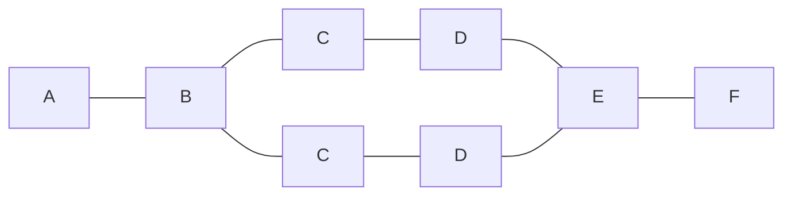

# やりたいこと
[Mermaid](https://mermaid-js.github.io/mermaid/#/) で以下のようなフローチャートを作りたいとする。

```
        C --- D
       /       \
A --- B         E --- F
       \       /
        C --- D
```

そして、以下のような Mermaid のフローチャートを書いたとする。

```
flowchart LR
    A --- B --- C --- D --- E --- F
    B --- C
    D --- E
```

しかし、これだと以下のように出力されてしまう。



以下のように書いた場合も同じ出力になる。

```
flowchart LR
    A --- B
    B --- C
    B --- C
    C --- D
    D --- E
    D --- E
    E --- F
```


同じ文字列のオブジェクトを複数箇所で書くと、それらは単一のオブジェクトとみなされ、二重結合してしまう。

# 正しい書き方
同じ文字列のオブジェクトを複数作成したい場合は、以下のように ID と文字列を別々に定義すれば良い。

```
flowchart LR
    A --- B --- c1[C] --- d1[D] --- E --- F
          B --- c2[C] --- d2[D] --- E
```

上記の例のように、`C` ではなく `c1[C]`、`c2[C]` のようにすることで、見た目上は同じ `C` となるが、別々のオブジェクトとして区別される。`D` も同様。

ID (上記の例でいう `c1`, `c2`, `d1`, `d2` の部分) はかぶらなければ任意の文字列を設定できる。単なる識別子で、出力結果には表示されない。

上記を出力すると以下のようになる。



# 参考サイト
* [Flowchart ― Mermaid](https://mermaid-js.github.io/mermaid/#/flowchart)
* [Duplicate objects in two directions #1231](https://github.com/mermaid-js/mermaid/issues/1231)
