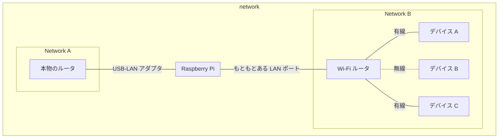

# 忙しい人向け
* 具体的な実現方法は知りたいけど前置きは読みたくない場合は [今回紹介するアプローチ](#今回紹介するアプローチ) からお読みください
* とにかく環境構築のやり方だけ知りたい場合は [準備](#準備) からお読みください

# はじめに
今まで数々のネットワーク制限のための仕組みを構築してきました。

* [Dnsmasq を使って特定のウェブサイトに OpenVPN 経由でアクセスできないようにする方法](https://zenn.dev/noraworld/articles/access-restriction-using-dnsmasq-via-openvpn)
* [Web プロキシサーバ Squid を利用して、特定のサイト・時間帯・曜日にアクセスできないようにする](https://zenn.dev/noraworld/articles/access-restriction-using-squid)
* [Dnsmasq を使って特定の時間帯・サイトへのアクセス制限をする](https://zenn.dev/noraworld/articles/access-restriction-using-dnsmasq)

今回の記事はこれらの強化版となります。


# 前置き
前置きが長くなることが多々あるなあと反省しつつ今回も今回とて語らせてください。(反省してない)

## その努力の根源はどこから
これは、この種の記事で毎回書いていることなのですが、改めて丁寧に言語化してみようと思います。

端的に言えば、『誘惑の遮断をシステム化するため』です。

筆者は映像コンテンツが大好きです。YouTube や VOD などを見始めると止まらなくなってしまいます。

昔の話ですが、ひどいときだと一日中家に引きこもってずっと十数時間ずっと YouTube を見ていた時期もありました。

それはそれで楽しいのですが、こうして技術記事を書こうと思ってもついつい動画を見たくなってしまい、ちょっとだけと思って見始めたら最後。結局それでその日が終わってしまうなんてことはザラにあります。特に社会人ともなると平日の仕事以外の時間は貴重です。

そんな大事な時間を有意義に使いたいと思っても、人間の誘惑と怠惰が邪魔をします。手を伸ばせばすぐアクセスできるものであればあるほど、その誘惑に打ち勝つのは難しいことはみなさんもおそらく経験しているでしょう。

そこで思いつくのがウェブサイトの制限です。ついテレビを見てしまうのであればテレビを家から処分すれば良い。ついお菓子を食べすぎてしまうのであればお菓子を買わなければ良い。でも、つい YouTube を見てしまうからと言ってインターネットを解約するわけにはいきません。不便云々の前に仕事もできません。

だから、特定のサイトのみをブロックする仕組みを構築したいのです。

誰でもすぐ簡単にできる仕組みとしてブラウザの拡張機能や、iPhone や Mac のスクリーンタイム機能があります。これなら手間も時間もそれほどかからずにサイト制限をかけることができます。

しかしこれらには問題があります。

* 簡単に制限を外せてしまう
* デバイスごとに設定しなければならない
* これらの仕組みが存在しないデバイスでは制限を設けることができない

特に筆者のような誘惑に弱い人間には簡単に制限を外せてしまうというのが致命的で、これまで何度も失敗してきました。また、仮にその制限により誘惑に打ち勝つことができても、制限がかかっていないデバイスがすぐ手の届く位置にあれば同じことです。

## 着想
これらの問題を解決するための方法としてネットワークレベルで制限をかけるというのを思いつきました。

今までに数々の方法でネットワーク対策を確立してきましたが、どれも簡単に制限を外せてしまうという観点では完全に満足できるものではありませんでした。冒頭でこれまでに試したネットワーク制限の技術記事を紹介しましたが、以下に挙げるのはその問題点です。

| 対策方法 | 問題点 |
| --- | --- |
| DNS で特定のドメインを名前解決できないようにする | • 各種デバイスで DNS サーバを簡単に変更できてしまう |
| プロキシサーバで特定のドメインの拒否設定を行う | • 各種デバイスに明示的にプロキシサーバを指定しなければならない<br>• 簡単に設定を外せてしまう<br>• プロキシサーバを経由しないアプリケーションでは無効<br>• すべての端末でプロキシサーバを設定できるとは限らない |
| ルータで特定の転送パケットをドロップする[^1] | • 制限するサイトの数に応じて通信速度が著しく低下する<br>• 制限されたリソースがタイムアウトになるまでロードし続けるのでサイトによっては表示にものすごく時間がかかる[^3] |

[^1]: これは直近に試したのですが、この内容を記事にする前に今回紹介するより良い方法を思いついたので記事にはしていません。

[^3]: 例として、パケット内に `youtube.com` と含まれているパケットをドロップするルールを入れていると、たとえば [このページ](https://jp-news.mercari.com/articles/2019/07/19/item-rule-pse-symbol/) へのアクセスにかなり時間がかかります。

今まで試していたのは DNS やプロキシなど、上のレイヤーからのアプローチだったのですが、やはり TCP/IP レイヤーなどでないと完全に制御するのは難しいということがわかりました。

しかし、実際にルータでパケットフィルタリングしてみると、性能面での問題や表示速度の問題が浮き彫りになりました。パフォーマンスを犠牲にせずに TCP/IP 層で制限をかけるのは難しいという結論に至りました。

以下は制限するサイトの数[^6][^7] (ルール) とそのときの通信速度を調べた表です。ルールを増やせば増やすほど通信速度が遅くなっていることがわかります。

[^6]: ルールのすべてが特定のウェブサイトの制限ではないので、実際には制限していたサイトの数は少ないです。

[^7]: ルール数の計測は `sudo iptables-save | wc -l` で行いました。

| [ルール 129 個](https://www.speedtest.net/result/13786229845) | [ルール 178 個](https://www.speedtest.net/result/13785172559) | [ルール 476 個](https://www.speedtest.net/result/13785212312) |
| --- | --- | --- |
|  |  |  |

さらに 476 個のときはさすがに Raspberry Pi のルータとしての負荷が高すぎて PulseAudio の音声が乱れるなど、他のプロセスのパフォーマンスにも影響を及ぼしてしまっていました。

どうしようかと考えていたところ、良いアイデアが思い浮かびました。DNS による制限は優秀だが、デバイスの設定でパブリック DNS などを指定してしまうと簡単に制限を解除できてしまう。でも、用意した DNS 以外を使用禁止にすることができれば…… と。

今回紹介するのはその制限の仕組みと構築方法になります。


# 今回紹介するアプローチ
相変わらず前置きが長くなってしまいましたが、ここからようやく本題です。

DNS によるネットワーク制限の問題は、パブリック DNS などの指定により簡単に制限を外せてしまうことです。

一方、ルータによるパケットフィルタリングの問題は、パフォーマンスです。

つまり、この 2 つを組み合わせてそれぞれの良いとこ取りをすれば問題解決するのでは、というところから着想を得ています。

具体的には、DNS レベルで特定のサイトをブロックしつつ、TCP/IP レベルで DNS のウェルノウンポートである 53 番ポートを遮断すれば良いわけです。

でも、DNS サーバをデバイス側で簡単に変更できてしまうのと同じように、ルータ (デフォルトゲートウェイ) もデバイス側で簡単に変更できてしまうのでは？ と思った方もいるかもしれません。

そこで、もうひと手間加えます。ネットワークを物理的に 2 つに分断します。


通常の家庭では、ネットワークはプロバイダが提供するルータあるいは市販で購入したルータを基軸に単一のネットワークが形成され、そのネットワーク内に各々のデバイスが属していると思います。

今回はネットワークを 2 つのセグメントに分離します。片方は本物のルータ (プロバイダのルータや市販のルータ等) と Raspberry Pi のみが属するネットワーク、もう片方は Raspberry Pi と各種デバイスが属するネットワーク、というように分けます。

そして Raspberry Pi 内でルータと DNS サーバを立てておきます。

こうすることにより、各種デバイスは Raspberry Pi をルータにしない限りインターネットに接続することができません。本物のルータをデフォルトゲートウェイに設定しようとしてもセグメントが異なるため不可能です。

あとは Raspberry Pi 内のルータ (ファイアウォール) の設定で 53 番ポートを遮断し、DNS サーバで特定のサイトをブロックすれば、物理的にネットワーク構成をもとに戻すか Raspberry Pi 内の設定を変更しない限りは抜けることができない制限を構築することができます。

この記事では取り扱いませんが、筆者はさらにファイアウォールや DNS の設定を簡単に変えられないように cron でスクリプトを定期的に走らせて設定が正しいかどうかを監視したり、設定ファイルを特定の時間帯以外に書き換えようとしたら自動的にもとに戻るファイル監視システムを導入したりしています。

ここまでやれば、がんばって制限を外すのにかかる時間や労力を考えて、その間に冷静さを取り戻すことができます。

では具体的な構築方法についてこれから紹介していきます。


# 準備
まず、以下のものを準備してください。

* [Raspberry Pi](https://www.raspberrypi.com/products/raspberry-pi-4-model-b/)
    * Linux (Ubuntu) がインストールされたコンピュータなら理論上は何でも良いのですが、ルータ・DNS サーバとして 24 時間稼働させることを考えると、消費電力の観点から Raspberry Pi のような低消費電力コンピュータが望ましいです
    * ちなみに筆者 Raspberry Pi 4B を使用しています
* [LAN-USB アダプタ](https://www.amazon.co.jp/gp/product/B08B691ZP3)
    * 2 つのネットワークを構築するためには LAN ポートが 2 つ必要ですが、Raspberry Pi は LAN ポートが 1 つしかないためそれを増設するために使用します
    * Raspberry Pi 4 の場合は必ず USB 3.0 ポート (端子が青色のほうの USB ポート) に接続してください
    * ドライバのインストールが不要なものを選んでください
* [市販の Wi-Fi ルータ](https://www.elecom.co.jp/products/WRC-2533GST2.html)
    * ルータと書きましたが実際には Wi-Fi のアクセスポイントとしてのみ使用します
    * 有線接続する場合は本来であればスイッチングハブが必要ですが、近年の Wi-Fi ルータは LAN ポートが複数ついていることが多いのでこれで代用できます
    * Wi-Fi ルータなのでもちろん無線接続する場合にも使えて一石二鳥です
    * Raspberry Pi 以外の端末を無線でしか接続しない場合は Raspberry Pi を Wi-Fi のアクセスポイントにするということもできそうですが、有線接続に対応するためにはスイッチングハブが必要で、それを用意するなら Wi-Fi ルータで無線・有線の両方を兼用することができるため、この記事では Raspberry Pi をアクセスポイントにする方法については取り扱いません
* [LAN ケーブル](https://www.amazon.co.jp/gp/product/B007WSIZKK) × N 本 (機器をつなぐ数だけ)


# 環境
* Ubuntu Server 22.04.1 LTS
    * あらかじめ Raspberry Pi に Ubuntu Server をインストールしておいてください
    * Ubuntu 以外の Linux ディストリビューションでも実現できますが、その場合は各種コマンドの違いなどについては適宜調整してください


# 物理的なネットワークを再構築
ネットワークを以下のように物理的に配線してください[^4][^5]。



[^4]: 図中の『有線』『無線』の表記は有線・無線のどちらでも接続可能ということを表しています。必ずしもこの通りに接続する必要はありません。

[^5]: 図の表現上、Raspberry Pi はネットワーク A にも B にも属していないように見えますが、実際にはネットワーク A, B の両方に属しています。


Wi-Fi ルータはアクセスポイントモードに変更しておいてください。機器によって設定の仕方は異なるかもしれませんが、たいていの場合は本体に動作モードを変更するための物理的な切替スイッチまたはボタンがついていると思います。

これで、インターネットに接続する能力を有する本物のルータと Raspberry Pi が属するネットワーク A と、Raspberry Pi と各種デバイスが属するネットワーク B の 2 つのネットワークを物理的に構築することができました。

なお、以降の説明ではネットワーク A, B という用語を使います。ネットワーク A は本物のルータが属するネットワーク、ネットワーク B は各種デバイスが属するネットワークです。どちらのネットワークのことを指しているのかここで覚えておいてください。

各種デバイスはネットワーク B に属するため、Raspberry Pi を無視して、ネットワーク A にある本物のルータにアクセスすることはできません。つまり、各端末は Raspberry Pi をルータ (デフォルトゲートウェイ) に設定しない限りはインターネットに接続することができません。


# IP アドレスの設定と 2 つのセグメントの結合
ここから先は Raspberry Pi 内の操作になります。

`/etc/netplan/` 以下に新しくファイルを作ります。すでに自分で作ったことがある場合はそのファイルを編集します。

ファイル名は以下のルールに従ってください。

* `/etc/netplan/` にすでに存在するファイルのファイル名先頭の数字よりも大きいものをファイル名の先頭につける
* 拡張子は `.yaml` とする

おそらく最初から `/etc/netplan/50-cloud-init.yaml` というファイルが存在するかと思うので、このファイルよりもあとに読み込まれる必要があります。ファイルは辞書順に読み込まれるので、この場合は 50 よりも大きい数字をファイル名の先頭につける必要があります。この記事では `99_config.yaml` というファイル名にしています。

元から存在していたファイル (`50-cloud-init.yaml`) を直接編集しないでください。システムが作成したファイルの中身は何かのタイミングで変更がもとに戻る可能性があります。

ファイルを作ったら、以下のような設定を書き込みます。

```yaml:/etc/netplan/99_config.yaml
network:
  version: 2
  renderer: networkd
  ethernets:
    eth1:
      dhcp4: no
      addresses:
        - 192.168.3.2/24
      routes:
        - to: default
          via: 192.168.3.1
        - to: 192.168.3.0/24
          via: 192.168.3.1
          table: 101
      routing-policy:
        - from: 192.168.3.0/24
          table: 101
      nameservers:
        addresses: [1.1.1.1]
    eth0:
      dhcp4: no
      addresses:
        - 192.168.82.2/24
      routes:
        - to: 192.168.82.0/24
          via: 192.168.82.1
          table: 102
      routing-policy:
        - from: 192.168.82.0/24
          table: 102
      nameservers:
        addresses: [1.1.1.1]
```

* `eth1`
    * 今後の説明ではこちら側をネットワーク A と呼ぶことにします
    * `192.168.3.0/24` に設定しています
        * これは本物のルータの設定と同じにしておく必要があります
* `eth1.addresses`
    * ネットワーク A 側の Raspberry Pi の IP アドレスです
    * `192.168.3.2/24` に設定しています
    * この IP アドレスは本物のルータと重複しないように注意してください
* `eth1.routes[*].via`
    * 本物のルータの IP アドレスを指定します
    * 筆者の環境では `192.168.3.1` が設定されていたのでこれを設定しています
* `eth0`
    * 今後の説明ではこちら側をネットワーク B と呼ぶことにします
    * `192.168.82.0/24` に設定しています[^2]
* `eth0.addresses`
    * ネットワーク B 側の Raspberry Pi の IP アドレスです
    * `192.168.82.2/24` に設定しています
* `nameservers.addresses`
    * Raspberry Pi が問い合わせる上位 DNS サーバを指定します
    * 何でも良いのですが筆者は `1.1.1.1` (Cloudflare DNS) を使用しています

[^2]: サブネットマスクさえ正しく設定できていれば、ネットワーク A と B をそれぞれ近い数値にしても問題はないのですが、数値が近いとそれぞれどちらなのか混乱してしまうことがあるので、離れた数値にしておくことをおすすめします。ちなみに `82` というのは Raspberry Pi の頭文字である `R` の ASCII コード番号に由来しています。

ネットワークインターフェース名 `eth0` と `eth1` が実際と異なる場合は適宜変更してください。Raspberry Pi に Ubuntu をインストールしている場合は、もともと存在する LAN ポートが `eth0` で、USB-LAN アダプタの LAN ポートが `eth1` になるはずです。

なお、ネットワークインターフェース名を調べるには以下のコマンドを実行します。

```shell:Shell
ip a | grep -E "^[0-9]*:"
```

```
1: lo: <LOOPBACK,UP,LOWER_UP> mtu 65536 qdisc noqueue state UNKNOWN group default qlen 1000
2: eth0: <BROADCAST,MULTICAST,UP,LOWER_UP> mtu 1500 qdisc mq state UP group default qlen 1000
3: eth1: <BROADCAST,MULTICAST,UP,LOWER_UP> mtu 1500 qdisc fq_codel state UP group default qlen 1000
4: wlan0: <NO-CARRIER,BROADCAST,MULTICAST,UP> mtu 1500 qdisc fq_codel state DOWN group default qlen 1000
```

`lo` と `wlan0` はそれぞれ、ループバック、Wi-Fi のネットワークインターフェースを指すので、残った `eth0` と `eth1` が LAN ポートで接続されたネットワークインターフェースだということがわかります。

慣習的に順番に数字が割り当てられるはずなので `eth0` がもともとある LAN ポートのはずですが、不安な場合は一度 USB-LAN アダプタを抜いてみて、`eth0` だけが認識されることを確認してください。


# DNS サーバ・DHCP サーバの設定
これに関しては [Dnsmasq を使って特定の時間帯・サイトへのアクセス制限をする](https://zenn.dev/noraworld/articles/access-restriction-using-dnsmasq) とほぼ同じ設定をするだけなので細かい部分は該当記事を参照してください。

ここでは主要な部分だけかいつまんで解説します。

## Dnsmasq のインストール
まずは DNS サーバ・DHCP サーバをインストールします。

```shell:Shell
sudo apt -y install dnsmasq
```

## 基本的な設定を追加
最低限必要な設定を追加します。設定ファイルは `/etc/dnsmasq.conf` です。

```conf:/etc/dnsmasq.conf
listen-address=127.0.0.1,192.168.3.2,192.168.82.2
bind-interfaces
no-hosts
dhcp-range=192.168.82.200,192.168.82.254,12h
dhcp-option=option:netmask,255.255.255.0
dhcp-option=option:router,192.168.82.2
dhcp-option=option:dns-server,192.168.3.2
conf-dir=/etc/dnsmasq.d
max-ttl=300
```

* `listen-address`
    * `127.0.0.1` と Raspberry Pi に割り当てた IP アドレスを指定します
* `dhcp-range`
    * ネットワーク B の範囲内の IP アドレスを指定します
    * ここでは 200 〜 254 となっていますがこの範囲内に Raspberry Pi 自身 (`192.168.82.2`) が入らなければもう少し広く取っても大丈夫です
    * ただしほとんどの一般家庭では 55 個割り当てることができれば必要十分だと思います
* `dhcp-option=option:netmask`
    * ネットワーク B のサブネットマスクを指定します
* `dhcp-option=option:router`
    * ルータ、つまり Raspberry Pi の IP アドレスを指定します
    * ネットワーク A 側の Raspberry Pi の IP アドレス (`192.168.3.2`) を指定することもできますが、一部のデバイスでは問題が生じるためネットワーク B 側の IP アドレスを指定することを推奨します
        * たとえば ScanSnap という機器では、自身が属するネットワークとは異なるセグメントに属するルータをデフォルトゲートウェイに設定するとエラーになってしまいます
* `dhcp-option=option:dns-server`
    * DNS サーバ、つまり Raspberry Pi の IP アドレスを指定します
    * 本当は `192.168.82.2` を設定するはずでしたがなぜかそちらだとつながらなかったので `192.168.3.2` にしています
* `max-ttl`
    * クライアントが持つ DNS キャッシュの保持期間 (秒) を指定します
    * 長いとキャッシュが効いてしまい、制限時間になってもすぐにアクセス不可にはならないことがあります
    * 筆者は現在 5 分 (300 秒) に設定しています

## 制限ファイルと cron の設定
任意の場所に任意のファイル名で以下のような設定を書きます。以下は YouTube をアクセス制限するための設定です。ドメイン名をあなたが制限したいものに置き換えてください。今後は制限するサイトを YouTube として説明します。

```file:/path/to/youtube.conf
address=/youtube.com/
```

そして cron で `/etc/dnsmasq.d/` 以下に上記のファイルのシンボリックリンクを貼ったり剥がしたりすることで、特定の時間帯のみ YouTube にアクセスできないようにすることができます。

たとえば 21 〜 23 時のみ YouTube にアクセスできるようにする (それ以外の時間帯はアクセス不可とする) 場合は cron に以下の設定を追加します。

```shell:Shell
crontab -e
```

```
0 21 * * * sudo unlink                       /etc/dnsmasq.d/youtube.conf && sudo systemctl restart dnsmasq
0 23 * * * sudo ln -s  /path/to/youtube.conf /etc/dnsmasq.d/youtube.conf && sudo systemctl restart dnsmasq
```

## Dnsmasq の起動
Dnsmasq を起動して DNS サーバ・DHCP サーバを稼働させます。

```shell:Shell
sudo systemctl start dnsmasq
```

## 動作確認 (するとは言ってない)
現時点ではまだインターネットに接続できないのでいったん他の設定を済ませてから動作確認を行います。


# ファイアウォールの設定
このままでは各種デバイスのネットワーク設定で DNS の設定を変更してしまうと簡単に制限が外れてしまいます。そこで、他の DNS に浮気できないように、53 番ポートを Raspberry Pi のファイアウォールで遮断します。

この設定を行うことにより、各種デバイスでパブリック DNS などを設定したとしても、53 番ポートが遮断されている以上は名前解決ができません。そうなるとインターネットがほぼ使えなくなってしまうので、実質的に Raspberry Pi の DNS サーバに頼らざるを得ない状況を作ります。

ここではファイアウォールの設定に UFW を使います。Ubuntu Server の場合は最初からインストールされています。

## UFW の起動
UFW を起動します。

```shell:Shell
sudo ufw enable
```

## 53 番ポート (FORWARD) を遮断
53 番ポートの転送用のパケットを遮断します。

```shell:Shell
sudo ufw route deny from any to any port 53
```

これでパブリック DNS や本物のルータが持つ DNS サーバ機能は各端末で利用できなくなりました。

## 53 番ポート (INPUT) を許可
パブリック DNS が利用できなくなったのは良いですが、このままだと Raspberry Pi の DNS も利用できません。

そのため、Raspberry Pi への DNS 通信は許可します。

```shell:Shell
sudo ufw allow proto udp from any to any port 53
```

## 67, 68 番ポート (INPUT) を許可
DHCP サーバの通信を許可します。

```shell:Shell
sudo ufw allow proto udp from any to any port 67:68
```

## マスカレードの設定
`eth0` は本物のルータが属するネットワークのインタフェースなのでインターネットにつながっています。しかし `eth1` はこの時点ではまだインターネットにつながっていません。つまり、各種デバイスはまだインターネットに接続することができない状態です。

`/etc/ufw/before.rules` に以下の設定を追加して `eth1` 側もインターネットに接続できるようにします。

```/etc/ufw/before.rules
*nat
:POSTROUTING ACCEPT [0:0]
-A POSTROUTING -s 192.168.82.0/24 -o tun0 -j MASQUERADE
-A POSTROUTING -o eth1 -j MASQUERADE
COMMIT
```

`*nat` と `COMMIT` はすでに記載されているはずですので、必ず `*nat` と `COMMIT` の間に `POSTROUTING` の設定を追加してください。

## 設定の確認
以下のコマンドを実行して設定を確認します。

```shell:Shell
sudo ufw status
```

以下のようになっていれば OK です。今回の説明に関係ない部分は表示を省いています。

```
Status: active

To                         Action      From
--                         ------      ----
53/udp                     ALLOW       Anywhere
67:68/udp                  ALLOW       Anywhere
53/udp (v6)                ALLOW       Anywhere (v6)
67:68/udp (v6)             ALLOW       Anywhere (v6)

53                         DENY FWD    Anywhere
53 (v6)                    DENY FWD    Anywhere (v6)
```

## 設定の反映
以下のコマンドを実行して設定を反映します。

```shell:Shell
sudo ufw reload
```


# 動作確認
意図したとおりに構築できているかどうか動作確認を行います。

## DNS
まずは DNS サーバが正しく動作しているか確認します。

### DHCP リースの更新
その前に、各端末で DHCP リースを更新してください。操作方法は端末によって異なりますが、どの端末でも共通して言えるのは再起動すればリースが更新されるということです。更新方法がわからなければとりあえず再起動してみてください。

各端末で自動的に IP アドレスが割り振られれば成功です。

### アクセス制限
運用上は cron で自動的に以下のコマンドが実行されますが、今回は動作確認のために手動で実行します。

```shell:Shell
sudo ln -s /path/to/youtube.conf /etc/dnsmasq.d/youtube.conf
sudo systemctl restart dnsmasq
```

これで Raspberry Pi の DNS を設定している端末では YouTube にアクセスできなくなったはずです。

以下のコマンドを実行する (PC の場合) か、ブラウザで [www.youtube.com](https://www.youtube.com) にアクセスして接続できなければ成功です。

```shell:Shell
# Raspberry Pi を DNS サーバに設定している端末で実行
curl https://www.youtube.com
```

```
curl: (6) Could not resolve host: www.youtube.com
```

一方で、制限をかけていないサイトへは通常通りアクセスできることを確認してください。

```shell:Shell
# Raspberry Pi を DNS サーバに設定している端末で実行
curl https://www.google.com
```

HTML が返ってくれば成功です。ブラウザで動作確認している場合はページが表示されれば成功です。

#### 注意事項
* Raspberry Pi 自身は上位の DNS を使用しているためアクセス可能です
    * Raspberry Pi 自身もアクセス制限をしたい場合は `/etc/netplan/99_config.yaml` の `network.ethernets[*].nameservers.addresses[*]` の値を `1.1.1.1` から Raspberry Pi 自身の IP アドレス (`192.168.3.2`) に変更してください
* 直近で YouTube にアクセスしていた場合は DNS キャッシュが残っていてアクセスできてしまう可能性があります
    * その場合は 5 分以上 (`max-ttl` で設定した秒数以上) 待ってから再度試してみてください

## ファイアウォール
Raspberry Pi をルータとする各端末は、53 番ポートへの通信が遮断されているはずです。

以下のコマンドを実行する (PC の場合) か、端末の設定で DNS を手動で書き換えて (たとえば DNS サーバを `1.1.1.1` に変更して) 任意のウェブページ (たとえば [www.google.com](https://www.google.com)) にアクセスできなければ成功です。

```shell:Shell
# Raspberry Pi をルータ (デフォルトゲートウェイ) とする端末で実行
dig google.com @1.1.1.1
```

```
; <<>> DiG 9.10.6 <<>> google.com @1.1.1.1
;; global options: +cmd
;; connection timed out; no servers could be reached
```

一方で、Raspberry Pi の DNS サーバからは正常に返ってくることを確認してください。

```shell:Shell
# Raspberry Pi をルータ (デフォルトゲートウェイ) とする端末で実行
dig google.com @192.168.3.2
```

以下のような結果が返ってくれば成功です。ブラウザで動作確認する場合は DNS サーバの設定を Raspberry Pi の IP アドレスに戻して任意のウェブページ (制限していないもの) が表示されれば成功です。

```
; <<>> DiG 9.10.6 <<>> google.com @192.168.3.2
;; global options: +cmd
;; Got answer:
;; ->>HEADER<<- opcode: QUERY, status: NOERROR, id: 46906
;; flags: qr rd ra; QUERY: 1, ANSWER: 1, AUTHORITY: 0, ADDITIONAL: 1

;; OPT PSEUDOSECTION:
; EDNS: version: 0, flags:; udp: 4096
;; QUESTION SECTION:
;google.com.                    IN      A

;; ANSWER SECTION:
google.com.             47      IN      A       172.217.161.206

;; Query time: 109 msec
;; SERVER: 192.168.3.2#53(192.168.3.2)
;; WHEN: Thu Oct 13 03:22:49 JST 2022
;; MSG SIZE  rcvd: 55
```


# さいごに
今回のアプローチのポイントは

* 各端末が本物のルータに直接接触できないように、ネットワークを物理的に 2 つのセグメントに分断する
* 立ち上げた DNS サーバ以外のもの (パブリック DNS など) を使えないように 53 番ポートを遮断する
* DNS サーバで特定のサイトのドメインを名前解決できないようにする

の 3 点です。『DNS サーバで特定のサイトのドメインを名前解決できないようにする』以外はすべてこれのためのお膳立てです。Raspberry Pi 上に立てた DNS サーバを強制的に使用させるために、ネットワークを分離して Raspberry Pi をルータ (デフォルトゲートウェイ) にせざるを得ない状態にし、さらに 53 番ポートを遮断して Raspberry Pi を DNS サーバにせざるを得ない状態にしています。

[今回紹介するアプローチ](#今回紹介するアプローチ) の項でも説明しましたが、これらに加えて筆者は、Raspberry Pi 上の設定を簡単に変更できないような仕組みにしています。これにより制限時間中に制限を意図的に外すことが相当困難になります。そこまでの労力をかけることを想像している間に誘惑に打ち勝つための余裕が生まれるため、やるべきことに戻ることができます。

もともと意思が強い人ならわざわざこんなことをしなくても良いでしょうが、筆者のように誘惑に負けやすい人にはうってつけの方法ではないかなと思います。まあ環境構築が多少めんどうなのは玉に瑕ですが。


# 謝辞
本記事の基礎となっている『物理的にネットワークを分離』というアイデアは『[Dnsmasq を使って特定の時間帯・サイトへのアクセス制限をする](https://zenn.dev/noraworld/articles/access-restriction-using-dnsmasq)』の記事でいただいたコメントを参考にしています。この場を借りてお礼を申し上げます。

* https://zenn.dev/link/comments/4cda80b1e1c202
* https://zenn.dev/link/comments/0efeb8240f51a3


# 参考サイト
* [Ubuntu EC2 インスタンスでセカンダリネットワークインターフェイスを動作させるにはどうすればよいですか?](https://aws.amazon.com/jp/premiumsupport/knowledge-center/ec2-ubuntu-secondary-network-interface/)
* [iptables forwarding between two interface](https://serverfault.com/a/431607)
* [How to configure UFW to allow IP Forwarding?](https://askubuntu.com/a/1130516/1476690)
* [dnsmasqを使って内部向けDNSサーバを立てる](http://blog.poppypop.mydns.jp/2016/02/17/dnsmasq/) <!-- HTTP になっているので IP アドレス直打ちテストに使えそう -->
