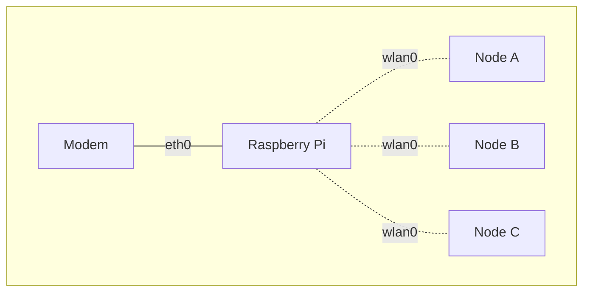

# はじめに
本記事では Raspberry Pi で Wi-Fi ルータ (Wi-Fi アクセスポイント + ルータ + DNS サーバ + DHCP サーバ) を作る方法について紹介します。

なお、Raspberry Pi ではなくても Wi-Fi 用のネットワークインターフェースカードを搭載した Linux マシンであれば同様の手順で実現できると思います。


# 環境
* Raspberry Pi 4 Model B
* Ubuntu 22.04.2 LTS


# 必要なパッケージのインストール
DNS サーバ・DHCP サーバとして機能する `dnsmasq` と、Wi-Fi 用のネットワークインターフェースカードをアクセスポイントとして動作させるためのパッケージである `hostapd` をインストールします。

```shell:shell
sudo apt -y install dnsmasq hostapd
```


# 不要なデーモンの無効化
Wi-Fi 用のネットワークインターフェースカードをクライアントではなくアクセスポイントとして動作させたい[^access-point]ので、クライアントとして動作させるための `wpa_supplicant` を無効化します。

[^access-point]: Raspberry Pi は別の Wi-Fi に無線接続して使用する (クライアントとして Wi-Fi を使用する) ことも、自身を Wi-Fi アクセスポイントとして動作させることもできます。

また、今回は IP アドレスやサブネットマスクなどの設定は `netplan` を使用しますので、`dhcpcd` が有効になっている場合は無効化します。

```shell:shell
sudo systemctl mask wpa_supplicant dhcpcd
sudo systemctl stop wpa_supplicant dhcpcd
```

なお、`wpa_supplicant` に関してはデーモンを停止させても数秒後に自動で起動してしまうので上記のように忘れずにマスクしてください。


# 固定 IP アドレスの割当
`netplan` を利用し、固定 IP アドレスの割当とサブネットマスクの設定を行います。

すでに `/etc/netplan/50-cloud-init.yaml` というファイルが存在するかと思いますが、このファイルは編集せず、代わりに同ディレクトリに `50` よりも大きい数字から始まる名前のファイルを作成してください。本記事では `/etc/netplan/99_config.yaml` とします。

そしてそのファイル内に以下の内容を書き込みます。

```yaml:/etc/netplan/99_config.yaml
network:
  version: 2
  renderer: networkd
  ethernets:
    eth0:
      dhcp4: yes
      dhcp-identifier: mac
      optional: true
    wlan0:
      dhcp4: no
      addresses:
        - 192.168.82.1/24
```

## ネットワーク構成について
ネットワークとしては、下図のように Raspberry Pi の LAN ポート (`eth0`) をご自宅にあるモデム等のポートに有線接続し、Raspberry Pi の無線 (`wlan0`) を利用して各種デバイス (`Node A`, `Node B`, `Node C`) をインターネットに接続することを想定しています。



## 上流のネットワーク機器に DHCP 機能がない場合
`eth0` は DHCP 機能で IP アドレスが自動割当されていることを想定しています。上流のネットワーク機器にその機能がない場合は `wlan0` と同じような記法で IP アドレスを手動で割り当ててください。

## ネットワークインターフェース名が異なる場合
ネットワークインターフェース名 (`eth0`, `wlan0`) が異なる場合は適宜読み替えてください。ネットワークインターフェース名は以下のコマンドで確認することができます。

```shell:shell
ip a
```

## 設定の反映
変更を適用するには以下のコマンドを実行します。

```shell:shell
sudo netplan try
```

`Changes will revert in xxx seconds` というメッセージが表示されたあとエンターキーを押してください。

ただし、SSH 接続しており、上記コマンドを実行後にメッセージが表示されず接続が切れてしまった場合は設定に誤りがあります。一度そのセッションを終了し 2 分経ってからもう一度 SSH 接続してください。その後、設定ファイルに間違いがないかを確認してから同じ手順をお試しください。

## 設定の確認
以下のコマンドを実行して正しく IP アドレスが設定されているかどうかを確認します。

```shell:shell
ip a
```

以下のように `wlan0` に `192.168.82.1/24` という IP アドレスとサブネットマスクが設定されていることを確認してください。

```
1: lo: <LOOPBACK,UP,LOWER_UP> mtu 65536 qdisc noqueue state UNKNOWN group default qlen 1000
    link/loopback 00:00:00:00:00:00 brd 00:00:00:00:00:00
    inet 127.0.0.1/8 scope host lo
       valid_lft forever preferred_lft forever
    inet6 ::1/128 scope host
       valid_lft forever preferred_lft forever
2: eth0: <BROADCAST,MULTICAST,UP,LOWER_UP> mtu 1500 qdisc mq state UP group default qlen 1000
    link/ether xx:xx:xx:xx:xx:xx brd ff:ff:ff:ff:ff:ff
    inet 192.168.151.164/23 metric 100 brd 192.168.151.255 scope global dynamic eth0
       valid_lft 13405sec preferred_lft 13405sec
3: wlan0: <BROADCAST,MULTICAST,UP,LOWER_UP> mtu 1500 qdisc fq_codel state UP group default qlen 1000
    link/ether xx:xx:xx:xx:xx:xx brd ff:ff:ff:ff:ff:ff
    inet 192.168.82.1/24 brd 192.168.82.255 scope global wlan0
       valid_lft forever preferred_lft forever
```


# DNS サーバ・DHCP サーバの設定
`dnsmasq` を利用し、DNS サーバと DHCP サーバの設定を行います。

`/etc/dnsmasq.conf` というファイルを開き以下の設定を入力します。

```conf:/etc/dnsmasq.conf
# DHCP 範囲
dhcp-range=wlan0,192.168.82.201,192.168.82.254

# サブネットマスク
dhcp-option=wlan0,1,255.255.255.0

# ルータ
dhcp-option=wlan0,3,192.168.82.1

# DNS サーバ
dhcp-option=wlan0,6,192.168.82.1
```

今回は DHCP 機能で割り当てる IP アドレスの範囲は `192.168.82.201` 〜 `192.168.82.254` としました。

以下のコマンドを実行しデーモンを有効にします。

```shell:shell
sudo systemctl enable dnsmasq
sudo systemctl start dnsmasq
```


# ルーティングの設定
`sysctl` と `ufw` を利用し、ポートフォワーディングと IP マスカレード (NAPT) の設定を行います。

## ポートフォワーディングの有効
他のノード (パソコンやスマートフォンなど) から Raspberry Pi に向かってきたパケットを通すためにポートフォワーディングを有効にします。

まずは `/etc/sysctl.conf` というファイルを開き `net.ipv4.ip_forward=1` という行を有効にします。

```diff:/etc/sysctl.conf
-#net.ipv4.ip_forward=1
+net.ipv4.ip_forward=1
```

次に `/etc/default/ufw` というファイルを開き、`DEFAULT_FORWARD_POLICY` が `DROP` になっていたら `ACCEPT` に変更します。

```diff:/etc/default/ufw
-DEFAULT_FORWARD_POLICY="DROP"
+DEFAULT_FORWARD_POLICY="ACCEPT"
```

## ファイアウォールの有効
セキュリティ向上のためファイアウォールを有効にします。

`/etc/ufw/ufw.conf` というファイルを開き、`ENABLED` が `no` になっていたら `yes` に変更します。

```diff:/etc/ufw/ufw.conf
-ENABLED=no
+ENABLED=yes
```

## IP マスカレード (NAPT) の設定
`wlan0` を経由して Raspberry Pi に向かってきたパケットを `eth0` に通すために IP マスカレード (NAPT) の設定を行います。

`/etc/ufw/before.rules` というファイルを開き、ファイルの末尾に以下の行を追加します。

```diff:/etc/ufw/before.rules
+
+*nat
+:POSTROUTING ACCEPT [0:0]
+-A POSTROUTING -o eth0 -j MASQUERADE
+COMMIT
```

上記の設定がすべて完了したら以下のコマンドを実行し設定を反映させます。

```shell:shell
sudo ufw enable
sudo ufw reload
```


# Wi-Fi の設定
Raspberry Pi の Wi-Fi が有効になっていない場合は以下のコマンドを実行して有効にします。

```shell:shell
sudo nmcli radio wifi on
sudo ip link set wlan0 up
sudo rfkill unblock wifi
sudo rfkill unblock wlan
```


# Wi-Fi アクセスポイントの設定
`hostapd` を利用して `wlan0` を Wi-Fi のアクセスポイントとして機能するように設定します。

`/etc/default/hostapd` というファイルを開き、設定ファイルのパスを指定します。`DAEMON_CONF` に `/etc/hostapd/hostapd.conf` を指定します。

```diff:/etc/default/hostapd
-DAEMON_CONF=""
+DAEMON_CONF="/etc/hostapd/hostapd.conf"
```

次に `/etc/hostapd/hostapd.conf` というファイルを開き Wi-Fi アクセスポイントの設定を入力します。

```conf:/etc/hostapd/hostapd.conf
driver=nl80211
ctrl_interface=/var/run/hostapd
ctrl_interface_group=0
auth_algs=1
wpa_key_mgmt=WPA-PSK
beacon_int=100
ssid=Raspberry Pi
channel=36
hw_mode=a
ieee80211n=1
require_ht=1
ht_capab=[MAX-AMSDU-3839][HT40+][SHORT-GI-20][SHORT-GI-40][DSSS_CCK-40]
ieee80211ac=1
require_vht=1
ieee80211d=0
ieee80211h=0
vht_capab=[MAX-AMSDU-3839][SHORT-GI-80]
vht_oper_chwidth=1
vht_oper_centr_freq_seg0_idx=42
wpa_passphrase=<YOUR_PASSWORD>
interface=wlan0
wpa=2
wpa_pairwise=CCMP
country_code=JP
ignore_broadcast_ssid=0
```

`<YOUR_PASSWORD>` に任意の Wi-Fi パスワードを設定してください。

## Raspberry Pi 4 以前のモデルを使用している場合
[Raspberry Pi 3 Model B](https://us.rs-online.com/m/d/4252b1ecd92888dbb9d8a39b536e7bf2.pdf) またはそれより古いモデルの Raspberry Pi の Wi-Fi は IEEE 802.11ac に対応していません。

そのため、上記の代わりに以下の設定を入力してください。

```conf:/etc/hostapd/hostapd.conf
driver=nl80211
ctrl_interface=/var/run/hostapd
ctrl_interface_group=0
auth_algs=1
wpa_key_mgmt=WPA-PSK
beacon_int=100
ssid=Raspberry Pi
channel=1
hw_mode=g
ieee80211n=0
wpa_passphrase=<YOUR_PASSWORD>
interface=wlan0
wpa=2
wpa_pairwise=CCMP
country_code=JP
ignore_broadcast_ssid=0
```

`<YOUR_PASSWORD>` は任意の Wi-Fi パスワードを置き換えます。

---

設定できたらデーモンを有効にします。

```shell:shell
sudo systemctl unmask hostapd
sudo systemctl enable hostapd
sudo systemctl start hostapd
```

これで Raspberry Pi が Wi-Fi ルータとして利用できるようになっているはずです。

お手持ちのパソコンやスマートフォンの Wi-Fi の設定にアクセスしてネットワーク一覧に `Raspberry Pi` という SSID のネットワークが表示されたらそれを選択し、設定したパスワードを入力します。

接続完了後、ブラウザで適当なウェブサイトにアクセスできれば成功です。お疲れ様でした。


# トラブルシューティング
この記事の手順に従っても設定しても正しく動作しない場合はこの項目の内容が役に立つかもしれません。

## 通信が不安定な場合
頻繁に Wi-Fi の接続が切れる、パケットロスが多い、通信速度が著しく遅く通信が切断されることがあるなどの問題が発生した場合はこの項目の内容をお試しください。

### 省電力モードの無効
Wi-Fi の省電力モードがオンになっている場合はオフにすることで改善するかもしれません。

以下のコマンドを実行して省電力モードが有効になっているかどうかを確認します。

```shell:shell
sudo iw wlan0 get power_save
```

`Power save: on` と表示された場合は以下のコマンドを実行し `off` に変更します。

```shell:shell
sudo iw wlan0 set power_save off
```

なお、この設定は再起動するたびにもとに戻るのでご注意ください。

### Bluetooth の無効
Bluetooth の電波が Wi-Fi に干渉して接続が不安定になることがあります。Bluetooth が有効になっている場合は無効にすることで改善されるかもしれません。

```shell:shell
sudo systemctl mask bluetooth
sudo systemctl stop bluetooth
```

可能であれば電波を発する Bluetooth 機器を Raspberry Pi からすべて外し再起動することもおすすめします。

### Wi-Fi を使用するその他のサービスの無効
今回導入した `hostapd` 以外で、Wi-Fi などの無線通信を利用したサービスがある場合はそのサービスが `hostapd` の動作に影響を与えている可能性があります。それらのサービスを一時的に無効にすることで改善されるかもしれません。

たとえば `shairport-sync` がインストールされている場合は一時的に無効にすることで症状が改善されるかどうかお試しください。

```shell:shell
sudo systemctl disable shairport-sync
sudo systemctl stop shairport-sync
```

## `sudo` 実行時に警告が表示される場合
`sudo` コマンドを実行した際に以下のような警告が表示されることがあります。

```
sudo: unable to resolve host ubuntu: Name or service not known
```

このメッセージが表示されたら、以下のコマンドを実行して `/etc/hosts` に該当するユーザのホストネームを追加します。

```shell:shell
sudo sh -c 'echo 127.0.1.1 $(hostname) >> /etc/hosts'
```


# 通信速度に関する補足
Raspberry Pi はあくまでシングルボードコンピュータのため、市販の Wi-Fi ルータと比べるとアクセスポイントとしての通信速度は劣りますが、普段使いなら十分な速度で通信を行うことができます。

参考までに、以下に Raspberry Pi 4 Model B (IEEE 802.11g & IEEE 802.11ac) と市販の Wi-Fi ルータでそれぞれ通信速度を計測した結果を掲載します。

| Raspberry Pi 4 Model B<br>(IEEE 802.11g) | Raspberry Pi 4 Model B<br>(IEEE 802.11ac) | [市販の Wi-Fi ルータ](https://www.elecom.co.jp/products/WRC-2533GST2.html)<br>(IEEE 802.11ac) |
| :---: | :---: | :---: |
|  |  |  |

IEEE 802.11g だと数値的には低くなってしまいますが、YouTube の 1080p でも映像が止まることなく視聴することができました。繰り返しになりますが、Raspberry Pi 4 Model B 以前の Raspberry Pi は IEEE 802.11ac に対応してないため、IEEE 802.11g 等を使用する必要があります。

ちなみに、IEEE 802.11ac よりさらに速い IEEE 802.11ax という規格がありますが、[Raspberry Pi 4 Model B](https://datasheets.raspberrypi.com/rpi4/raspberry-pi-4-product-brief.pdf) および [Raspberry Pi 5](https://datasheets.raspberrypi.com/rpi5/raspberry-pi-5-product-brief.pdf) は非対応です。

| Wi-Fi 規格名 | 最大通信速度 | 周波数 | 新呼称 |
| :--- | ---: | ---: | :---: |
| IEEE 802.11a | 54 Mbps | 5 GHz 帯 | |
| IEEE 802.11b | 11 Mbps | 2.4 GHz 帯 | |
| IEEE 802.11g | 54 Mbps | 2.4 GHz 帯 | |
| IEEE 802.11n | 600 Mbps | 2.4 GHz 帯<br>5 GHz 帯 | Wi-Fi 4 |
| IEEE 802.11ac | 6.9 Gbps | 5 GHz 帯 | Wi-Fi 5 |
| IEEE 802.11ax | 9.6 Gbps | 2.4 GHz 帯<br>5 GHz 帯 | Wi-Fi 6 |

_参考元: [【Wi-Fiルーター】2.4GHzと5GHzの違いについて](https://qa.elecom.co.jp/faq_detail.html?id=5953)_


# 参考サイト
* [ラズパイで作るWi-Fiアクセスポイントと、トラフィック計測 (ブリッジパターン)](https://blog.soracom.com/ja-jp/2022/10/31/how-to-build-wifi-ap-with-bridge-by-raspberry-pi/)
* [Raspberry PiをWiFiアクセスポイント化してスタンドアロン運用](https://www.mikan-tech.net/entry/raspi-wifi-ap)
* [ラズパイをアクセスポイント化、PCやスマホと直接繋ぐ方法](https://raspida.com/rpi-wifi-ap)
* [RaspberrypiをWifiアクセスポイントにする。（スタンドアローン）](https://qiita.com/T-ubu/items/906a8970da5dbec73cec)
* [Raspberry PiをWi-Fiアクセスポイントにする](http://herb.h.kobe-u.ac.jp/raspiinfo/raspiAP.html)
* [Raspberry Pi3A+ WiFiアクセスポイント&ルーター化](https://zenn.dev/technicarium/articles/14396c6c5221fd)
* [Setup Ubuntu server as Access point](https://gist.github.com/ExtremeGTX/ea1d1c12dde8261b263ab2fead983dc8)
* [LinuxのNetworkManger『nmcli』でネットワーク設定を管理するための覚書](https://zenn.dev/riko/articles/nmcli_memo_20220801)
* [Raspberry pi 4 - wifi drop the speed](https://github.com/RaspAP/raspap-webgui/issues/454#issuecomment-565366359)
* [detailed how to or example needed to setup an access point using netplan](https://askubuntu.com/questions/1222278/detailed-how-to-or-example-needed-to-setup-an-access-point-using-netplan)
* [ミニPCをUbuntuで無線LANルーター化](https://shimobepapa.hatenadiary.jp/entry/2021/10/24/152850)
* [RaspberryPi(Raspbian)の無線LAN親機（アクセスポイント）設定](https://qiita.com/n-yamanaka/items/e329e05b32207b43522a)
* [ラズパイを無線LANルーター化する ～アクセスポイント編～](https://www.itmedia.co.jp/news/articles/2008/14/news042.html)
* [Raspberry Pi 3 をアクセスポイントにする](https://s-edword.hatenablog.com/entry/2018/12/12/232705)
* [Using a Raspberry Pi 3 as a Wifi access point and bridge](https://gist.github.com/umardx/23cc3ad93119151a16f486c7cf01096c)
* [Is Pi 4 in Access Point mode slower than as a WiFi client?](https://raspberrypi.stackexchange.com/questions/133240/is-pi-4-in-access-point-mode-slower-than-as-a-wifi-client)
* [hostapd active and running but not broadcasting SSID](https://forums.raspberrypi.com/viewtopic.php?t=285718)
* [SSID of hostapd is not visible](https://unix.stackexchange.com/questions/494076/ssid-of-hostapd-is-not-visible)
* [sudo: unable to resolve host が表示されたら](https://qiita.com/ogomr/items/89e19829eb8cc08fcebb)
* [RPI3 as WiFi Router/Access Point](https://kasiviswanathanblog.wordpress.com/2017/05/29/rpi3-as-wifi-routeraccess-point/)
* [Raspberry PiのwifiのAP/Clientを切り替え](https://qiita.com/yamato225/items/24acb27403136732e01b)
* [dnsmasq, serve different ip addresses based on interface used](https://stackoverflow.com/questions/9326438/dnsmasq-serve-different-ip-addresses-based-on-interface-used#answer-26964151)
* [Set gateway per interface in DNSMasq](https://serverfault.com/questions/632588/set-gateway-per-interface-in-dnsmasq#answer-632593)
* [Dynamic Host Configuration Protocol (DHCP) and Bootstrap Protocol (BOOTP) Parameters](https://www.iana.org/assignments/bootp-dhcp-parameters/bootp-dhcp-parameters.xml)
